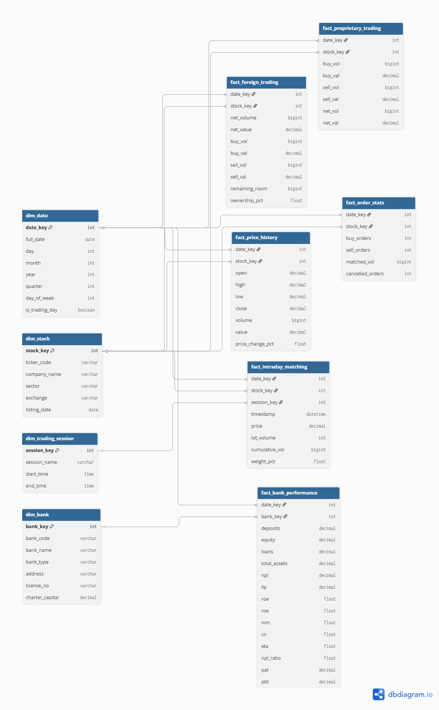
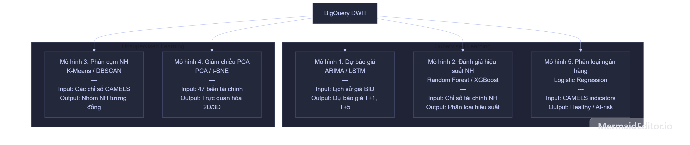

<div align="center">

# 🏦 Vietnamese Banking Financial Analytics Platform

### An End-to-End Data Warehouse and Machine Learning System for Vietnam's Financial Sector

[](https://python.org)
[](https://cloud.google.com/bigquery)
[](https://tensorflow.org)
[](https://scikit-learn.org)
[](https://lookerstudio.google.com)
[](./docs/proposal.md)

**Group 2 · Data Analysis · HCMUTE HK6 · 2026**

</div>

---

## 📋 Table of Contents

1. [Project Overview](#-project-overview)
2. [Research Questions and Hypotheses](#-research-questions--hypotheses)
3. [System Architecture](#-system-architecture)
4. [Data Pipeline](#-data-pipeline)
5. [Star Schema Design](#-star-schema-design)
6. [Machine Learning Models](#-machine-learning-models)
7. [Dataset](#-dataset)
8. [Directory Structure](#-directory-structure)
9. [Team and Roles](#-team-and-roles)
10. [Quick Start](#-quick-start)
11. [Documentation Index](#-documentation-index)
12. [References](#-references)

---

## 🎯 Project Overview

The Vietnamese stock market and banking system are experiencing significant fluctuations in capital flows and asset quality, demanding that investment and risk management decisions be grounded in data rather than intuition. This project addresses a critical gap: **the absence of a centralized analytical system** capable of simultaneously evaluating micro-level intraday trading data and macro-level financial health indicators spanning two decades.

### What This Platform Does

| Capability | Technology | Output |
|------------|------------|--------|
| **Centralized Data Warehouse** | Google BigQuery + Star Schema | Single source of truth for all financial data |
| **Stock Price Forecasting** | LSTM Deep Learning (T+1 → T+5) | Short-term BID price signals |
| **Bank Clustering** | K-Means + PCA | Strategic segmentation of 46 banks |
| **Credit Risk Classification** | Random Forest | Early warning for NPL ≥ 3% threshold |
| **Interactive Dashboard** | Looker Studio | Live BigQuery-connected reporting |

### Key Business Impact

> Reduces manual data aggregation and reporting time by **80%** through automated ETL pipelines and a standardized Star Schema architecture, while providing quantitative early-warning signals for credit risk management.

---

## 🔬 Research Questions & Hypotheses

This project is driven by four core research questions:

| # | Research Question | Hypothesis |
|---|------------------|------------|
| **Q1** | How do foreign investor and proprietary desk cash flows affect short-term BID stock price movements? | Sustained net buying from foreign and proprietary desks has a strong positive correlation with BID price trends in the T+1 to T+5 window. |
| **Q2** | Do the short-term closing price movements of the four banking stocks (BID, TCB, VCB, CTG) exhibit co-movement or divergence? | There is a strong short-term co-movement among state-owned commercial banks (BID, VCB, CTG), while the joint-stock commercial bank (TCB) exhibits more independent price movements. |
| **Q3** | Which financial indicators determine whether a bank falls into a high NPL risk group? | Banks with a high Cost-to-Income Ratio and low Equity-to-Asset ratio are most likely to exceed the 3% NPL threshold. |
| **Q4** | Can Vietnamese bank operating strategies be clearly segmented based on financial data? | Analysis will reveal 3 distinct clusters: state-owned banks optimizing scale, joint-stock banks optimizing profitability, and foreign banks optimizing capital safety. |

---

## 🏗 System Architecture

The platform is designed as a **5-layer, modular, batch-processing pipeline** following the CRISP-DM lifecycle.

```
┌───────────────────────┐     ┌──────────────────┐     ┌──────────────────┐
│  DATA SOURCE          │     │  ETL PIPELINE    │     │  DATA WAREHOUSE  │
│                       │     │                  │     │                  │
│  Excel & CSV Files    │────▶│ Extract          │────▶│ Google BigQuery  │
│  - Stocks (4 symbols) │     │ Transform/Clean  │     │ Star Schema      │
│    (BID, TCB, VCB, CTG)     │ Load via API     │     │5 Dims·5 Facts·3ML│
│  - Banks (2 files)    │     │ Python + Pandas  │     │                  │
└───────────────────────┘     └──────────────────┘     └────────┬─────────┘
                                                           │
                        ┌──────────────────┐     ┌────────▼─────────┐
                        │  PRESENTATION    │     │  ML & ANALYTICS  │
                        │                 │     │                  │
                        │ Looker Studio   │◀────│ LSTM · K-Means   │
                        │ 3 Dashboards    │     │ Random Forest    │
                        │ Live BigQuery   │     │ PCA · ARIMA(*)   │
                        └─────────────────┘     └──────────────────┘
```
*(\*) ARIMA serves as a performance comparison baseline only.*

---

## 🔄 Data Pipeline

The full end-to-end data flow from raw Excel sources to Looker Studio dashboards:


**Pipeline Stages:**

1. **Extract** — Read 7 structured Excel files using `pandas` + `openpyxl`
2. **Transform** — Clean missing values, standardize date formats, normalize features, generate surrogate keys
3. **Load** — Push structured DataFrames to BigQuery via `pandas-gbq` with partitioning and clustering
4. **Analyze** — ML models consume data directly from BigQuery Fact tables
5. **Serve** — Predictions written back to BigQuery; Looker Studio renders live dashboards

For detailed transformation rules per source file, see [`docs/etl-spec.md`](docs/etl-spec.md).

---

## 🗄 Star Schema Design

The Data Warehouse implements a **Star Schema** on Google BigQuery, optimized for OLAP analytical queries.



### Schema Summary

**5 Dimension Tables** (descriptive context):

| Table | Description |
|-------|-------------|
| `dim_date` | Calendar dimension with trading day flag (2002–2026) |
| `dim_stock` | BID, TCB, VCB, CTG stock descriptors (HPG removed to focus strictly on banking) |
| `dim_bank` | 46 commercial banks with SOCB / JSCB / FOCB classification and SCD Type 2 tracking (`valid_from`, `valid_to`, `is_current`) |
| `dim_trading_session` | ATO, Morning, Afternoon, ATC session definitions |
| `dim_audit` | ETL execution run log registry table |

*Note: All Dimension and Fact tables dynamically append the audit_key (INT64) and system auditing columns: `_created_at` (TIMESTAMP), `_updated_at` (TIMESTAMP), and `_source_file` (STRING).*

**5 Fact Tables** (quantitative measurements):

| Table | Granularity | Key Metrics |
|-------|-------------|-------------|
| `fact_price_history` | Daily per stock | OHLCV prices |
| `fact_foreign_trading` | Daily per stock | Foreign net volume and value |
| `fact_proprietary_trading` | Daily per stock | Proprietary desk net volume |
| `fact_order_stats` | Daily per stock | Buy/sell order counts and matched volume |
| `fact_bank_performance` | Annual per bank | Full CAMELS indicators — ROA, ROE, NIM, CIR, NPL, ETA |

**3 Machine Learning Output Tables** (model predictions and clusterings):

| Table | Granularity | Key Metrics |
|-------|-------------|-------------|
| `bank_cluster_assignments` | Per bank | Strategic bank cluster labels (`cluster_id`) |
| `bank_risk_predictions` | Annual per bank | Credit risk classifications (`risk_label`) and probability scores |
| `fact_model_predictions` | Daily per stock/horizon | Rolling multi-horizon BID closing price forecasting |

**BigQuery Optimizations:**
- **Partitioning**: All high-volume fact tables partitioned by `date_key` as DATE
- **Clustering**: Stock fact tables clustered by `stock_key`; bank fact table clustered by `bank_key`

For the complete field-level schema specification, see [`docs/star-schema.md`](docs/star-schema.md).

---

## 🤖 Machine Learning Models

Three production ML models are deployed, each solving a distinct financial analytical task:



### Model 1 — LSTM: Stock Price Forecasting

```
Input  : BID OHLCV + Foreign Net Volume + Proprietary Net Volume (rolling window)
Output : Predicted BID closing price for T+1, T+2, T+3, T+4, T+5
Scaler : MinMaxScaler on sequence windows
Baseline: ARIMA (comparison only — not deployed in production)
```

| Evaluation Metric | Requirement |
|-------------------|-------------|
| RMSE | < ARIMA baseline RMSE |
| MAE | Minimized on test set |
| MAPE | < ARIMA baseline MAPE |

### Model 2 — K-Means + PCA: Bank Clustering

```
Input  : 47+ CAMELS financial variables for 46 banks (2002–2022)
Process: StandardScaler → PCA (≥80% variance) → K-Means (Elbow + Silhouette)
Output : Cluster assignments written to BigQuery
```

| Evaluation Metric | Requirement |
|-------------------|-------------|
| Silhouette Score | Maximized (closer to 1 = better) |
| Davies-Bouldin Index | Minimized (lower = better separation) |

### Model 3 — Random Forest: Credit Risk Classification

```
Input  : CAMELS ratios (ROA, ROE, NIM, CIR, ETA, LTD, …) excluding NPL target
Target : Binary — 0 (Healthy: NPL < 3%)  |  1 (High Risk: NPL ≥ 3%)
Output : Risk labels + probabilities + Feature Importance → BigQuery
```

| Evaluation Metric | Acceptance Threshold |
|-------------------|--------------------|
| AUC-ROC | > **0.80** |
| F1-Score | Maximized |
| **Recall (High Risk class)** | ≥ **85%** ← critical constraint |

> **Why Recall ≥ 85%?** In financial risk management, a false negative — failing to identify a bank that will exceed the 3% NPL threshold — carries far greater consequences than a false positive. The model is explicitly tuned to prioritize detection sensitivity over precision.

For full model specifications, hyperparameter strategies, and MLOps retraining schedules, see [`docs/ml-spec.md`](docs/ml-spec.md).

---

## 📊 Dataset

### Primary Sources

| Source | Description | Volume | Link |
|--------|-------------|--------|------|
| **Stock Price History (BID, TCB, VCB, CTG)** | Daily historical trading data for banking stocks (BID, TCB, VCB, CTG) | 11,835+ rows | [CafeF](https://cafef.vn/) |
| **BID Stock Daily Stats** | Daily trading stats for BID — foreign trading, proprietary trading, order statistics | 22 trading sessions | [CafeF — BID](https://cafef.vn/du-lieu/lich-su-giao-dich/hose/bid-1.chn) |
| **VN Bank CAMELS Dataset** | 20-year CAMELS financial performance data for 46 Vietnamese commercial banks (2002–2022) | 667 rows × 47+ columns | [Harvard Dataverse — DOI:10.7910/DVN/RIWA3B](https://dataverse.harvard.edu/dataset.xhtml?persistentId=doi:10.7910/DVN/RIWA3B) |

### Key Financial Indicators (CAMELS Framework)

| Category | Indicators |
|----------|-----------|
| **Capital Adequacy (C)** | ETA (Equity-to-Asset), ETD (Equity-to-Deposit) |
| **Asset Quality (A)** | NPL Ratio, LLP Ratio |
| **Management (M)** | CIR (Cost-to-Income), NE (Employees), NB (Branches) |
| **Earnings (E)** | ROA, ROE, NIM, PAT, PBT |
| **Liquidity (L)** | LTA (Loans-to-Assets), LTD (Loans-to-Deposits) |
| **Sensitivity (S)** | GTA (Gross Loans-to-Assets), OBS |

For the complete variable definitions and data contracts, see [`docs/data-dictionary.md`](docs/data-dictionary.md).

---

## 📁 Directory Structure

```
vn-banking-dwh-analytics/
│
├── AGENTS.md                    # AI agent constitution (coding standards, constraints)
├── DEVELOPMENT.md               # Developer onboarding and contribution guide
├── README.md                    # This file
├── requirements.txt             # Python dependencies
├── .env.example                 # Environment variable template
├── .gitignore
│
├── data/
│   ├── raw/                     # Original source Excel files (7 files, git-ignored)
│   ├── processed/               # Cleaned intermediate DataFrames (git-ignored)
│   └── external/                # Reference data (holiday calendars, etc.)
│
├── docs/
│   ├── proposal.md              # Academic research proposal (Vietnamese)
│   ├── prd.md                   # Product Requirements Document
│   ├── star-schema.md           # Data Warehouse schema specification
│   ├── ml-spec.md               # ML model specifications and acceptance criteria
│   ├── system-arch.md           # System architecture design
│   ├── etl-spec.md              # Per-file ETL transformation rules
│   ├── data-dictionary.md       # Variable definitions and data contracts
│   ├── dashboard-spec.md        # Looker Studio acceptance criteria
│   ├── tasks.md                 # Atomic SDD implementation task checklist
│   ├── master-plan.md           # Project execution tracks and team roles
│   ├── env-config.md            # Environment setup guide
│   ├── product-brief.md         # Executive summary and document index
│   ├── project-overview.md      # Vietnamese project context document
│   ├── pipeline/                # Architecture diagram images
│   └── ref/                     # Reference materials and source links
│
├── notebooks/
│   ├── 01_EDA.ipynb             # Exploratory Data Analysis
│   ├── 02_ETL_BigQuery.ipynb    # ETL pipeline prototyping
│   ├── 03_ML_TimeSeries.ipynb   # LSTM and ARIMA experiments
│   ├── 04_ML_Clustering.ipynb   # K-Means + PCA experiments
│   ├── 05_ML_Classification.ipynb  # Random Forest experiments
│   └── 06_PCA_Visualization.ipynb  # Cluster and feature visualization
│
├── src/
│   ├── etl/                     # Production ETL batch scripts
│   │   ├── populate_dim_*.py    # Dimension table loaders (4 scripts)
│   │   ├── load_*.py            # Fact table ETL (6 scripts)
│   │   └── validate_integrity.py
│   ├── models/                  # Production ML training and inference scripts
│   │   ├── feature_engineering_*.py
│   │   ├── baseline_*.py        # ARIMA and Logistic Regression baselines
│   │   └── train_*.py           # LSTM, K-Means, Random Forest
│   └── utils/                   # Shared utilities
│       ├── bigquery_client.py
│       ├── logger.py
│       └── config.py
│
├── reports/
│   ├── figures/                 # Generated charts and evaluation plots
│   └── models/                  # Saved model artifacts (git-ignored)
│
└── sql/
    └── bigquery_schema.sql      # BigQuery DDL for all tables
```

---

## 👥 Team and Roles

The project is executed under a **concurrent, role-based strategy** across 4 parallel tracks:

| Name | Role | Responsibilities |
|------|------|------------------|
| **Trần Minh Khánh** | Data Analysis + Data Warehouse | EDA, raw data extraction, missing value handling, feature normalization |
| **Nguyễn Đặng Quốc Anh** | Data Processing + Project Owner + Machine Learning | ETL pipeline, data cleaning and transformation, BigQuery load |
| **Phạm Minh Quân** | Machine Learning + Business Analysis + Data Analysis | LSTM, K-Means, Random Forest training, hyperparameter optimization, BigQuery write-back |
| **Đỗ Kiến Hưng** | Data Warehouse + Project Manager + Data Processing | Star Schema design, BigQuery provisioning, data integrity validation, Looker Studio dashboards |

---

## 🚀 Quick Start

### Prerequisites

- Python 3.9+
- A Google Cloud Platform project with BigQuery API enabled
- A GCP Service Account JSON key with `BigQuery Data Editor` and `BigQuery Job User` roles

### Step 1 — Clone and Set Up Environment

```bash
git clone <repository_url>
cd vn-banking-dwh-analytics

# Create and activate virtual environment
python -m venv venv
venv\Scripts\activate      # Windows
# source venv/bin/activate # macOS / Linux

pip install -r requirements.txt
```

### Step 2 — Configure Credentials

```bash
# Copy the environment template
copy .env.example .env    # Windows
# cp .env.example .env   # macOS / Linux

# Edit .env with your actual values
# GCP_PROJECT_ID, BQ_DATASET_ID, GOOGLE_APPLICATION_CREDENTIALS, etc.
```

```powershell
# Windows — Set the GCP credentials path
$env:GOOGLE_APPLICATION_CREDENTIALS="C:\path\to\your\service-account.json"
```

For detailed setup instructions, see [`docs/env-config.md`](docs/env-config.md).

### Step 3 — Initialize the Data Warehouse

```bash
# Provision all 10 BigQuery tables (run once)
python -m src.etl.populate_dim_date
python -m src.etl.populate_dim_stock
python -m src.etl.populate_dim_bank
python -m src.etl.populate_dim_trading_session

# Load fact tables incrementally via MERGE (place raw Excel/CSV files in data/raw/ first)
python -m src.etl.load_price_history
python -m src.etl.load_foreign_trading
python -m src.etl.load_proprietary_trading
python -m src.etl.load_order_stats
python -m src.etl.load_bank_performance

# Validate data integrity
python -m src.etl.validate_integrity
```

### Step 4 — Train ML Models

```bash
python -m src.models.feature_engineering_stock
python -m src.models.feature_engineering_bank
python -m src.models.baseline_arima        # Establish ARIMA benchmark
python -m src.models.train_lstm            # Train LSTM; predictions → BigQuery
python -m src.models.train_kmeans          # Cluster 46 banks; assignments → BigQuery
python -m src.models.baseline_logistic     # Establish Logistic Regression benchmark
python -m src.models.train_random_forest   # Train RF; risk labels → BigQuery
```

### Step 5 — Connect Looker Studio

1. Navigate to [lookerstudio.google.com](https://lookerstudio.google.com)
2. Create a new report → **Add data** → select **BigQuery** native connector
3. Authenticate with your GCP account that has `BigQuery Data Viewer` access
4. Select your `GCP_PROJECT_ID` and `BQ_DATASET_ID`
5. Build dashboards per the specifications in [`docs/dashboard-spec.md`](docs/dashboard-spec.md)

---

## 📚 Documentation Index

| Document | Purpose | Audience |
|----------|---------|----------|
| [`docs/proposal.md`](docs/proposal.md) | Academic research proposal | Academic committee |
| [`docs/prd.md`](docs/prd.md) | Full functional and non-functional requirements | All members |
| [`docs/star-schema.md`](docs/star-schema.md) | DWH schema — field types, relationships, BigQuery optimizations | Đỗ Kiến Hưng |
| [`docs/etl-spec.md`](docs/etl-spec.md) | Per-file ETL column mappings and transformation rules | Trần Minh Khánh & Nguyễn Đặng Quốc Anh |
| [`docs/data-dictionary.md`](docs/data-dictionary.md) | Variable definitions and data quality rules | All members |
| [`docs/ml-spec.md`](docs/ml-spec.md) | ML architecture, hyperparameters, and acceptance criteria | Phạm Minh Quân |
| [`docs/dashboard-spec.md`](docs/dashboard-spec.md) | Looker Studio chart-level acceptance criteria | Đỗ Kiến Hưng |
| [`docs/system-arch.md`](docs/system-arch.md) | System architecture and data flow diagram | All members |
| [`docs/tasks.md`](docs/tasks.md) | Atomic SDD task checklist with verification criteria | All members |
| [`docs/master-plan.md`](docs/master-plan.md) | Concurrent execution tracks and team structure | All members |
| [`docs/env-config.md`](docs/env-config.md) | Local and cloud environment setup guide | All members |
| [`DEVELOPMENT.md`](DEVELOPMENT.md) | Developer onboarding, coding standards, Git workflow | All members |
| [`AGENTS.md`](AGENTS.md) | AI agent constitution and project constraints | AI tools |

---

## 📖 References

### Primary Dataset

1. **Harvard Dataverse — Vietnamese Bank CAMELS Dataset**
   Nguyen, T. L. A., & Vo, X. V. (2023). *Financial Performance of Vietnamese Commercial Banks (2002–2022)*. Harvard Dataverse. [https://doi.org/10.7910/DVN/RIWA3B](https://dataverse.harvard.edu/dataset.xhtml?persistentId=doi:10.7910/DVN/RIWA3B)

2. **MDPI Data Journal — Dataset Publication**
   Nguyen, T. L. A. (2022). *A Dataset of the Financial Performance of Listed Vietnamese Commercial Banks*. *Data*, 7(9), 120. [https://doi.org/10.3390/data7090120](https://www.mdpi.com/2306-5729/7/9/120)

### Market Data Sources

3. **BIDV Historical Stock Prices** — CafeF. [https://cafef.vn/du-lieu/lich-su-giao-dich/hose/bid-1.chn](https://cafef.vn/du-lieu/lich-su-giao-dich/hose/bid-1.chn)

4. **BIDV Investor Relations — Financial Reports** — BIDV Official. [https://bidv.com.vn/vn/quan-he-nha-dau-tu/bao-cao-va-tai-lieu/](https://bidv.com.vn/vn/quan-he-nha-dau-tu/bao-cao-va-tai-lieu/)

### Financial Metrics and Frameworks

5. **CAMELS Rating System** — Board of Governors of the Federal Reserve System. [https://www.federalreserve.gov/releases/bhcpr/](https://www.federalreserve.gov/releases/bhcpr/)

6. **30 Financial Metrics and KPIs** — NetSuite. [https://www.netsuite.com/portal/resource/articles/accounting/financial-kpis-metrics.shtml](https://www.netsuite.com/portal/resource/articles/accounting/financial-kpis-metrics.shtml)

7. **Vietnamese Corporate Financial Indicators** — VCBS. [https://www.vcbs.com.vn/chi-so-tai-chinh-doanh-nghiep](https://www.vcbs.com.vn/chi-so-tai-chinh-doanh-nghiep)

### Methodology References

8. **LSTM for Financial Time Series** — Hochreiter, S., & Schmidhuber, J. (1997). Long Short-Term Memory. *Neural Computation*, 9(8), 1735–1780. [https://doi.org/10.1162/neco.1997.9.8.1735](https://doi.org/10.1162/neco.1997.9.8.1735)

9. **Random Forest for Credit Risk** — Breiman, L. (2001). Random Forests. *Machine Learning*, 45, 5–32. [https://doi.org/10.1023/A:1010933404324](https://doi.org/10.1023/A:1010933404324)

10. **K-Means Clustering** — MacQueen, J. (1967). *Some methods for classification and analysis of multivariate observations*. Proceedings of the Fifth Berkeley Symposium, 1, 281–297.

11. **CRISP-DM Methodology** — Shearer, C. (2000). The CRISP-DM Model: The New Blueprint for Data Mining. *Journal of Data Warehousing*, 5(4), 13–22.

12. **BigQuery Star Schema Best Practices** — Google Cloud. [https://cloud.google.com/bigquery/docs/best-practices-performance-overview](https://cloud.google.com/bigquery/docs/best-practices-performance-overview)

---

<div align="center">

**Group 2 · Data Analysis Course · Ho Chi Minh City University of Technology and Engineering (HCM-UTE)**

*Built with Python · Google BigQuery · TensorFlow · scikit-learn · Looker Studio*

</div>