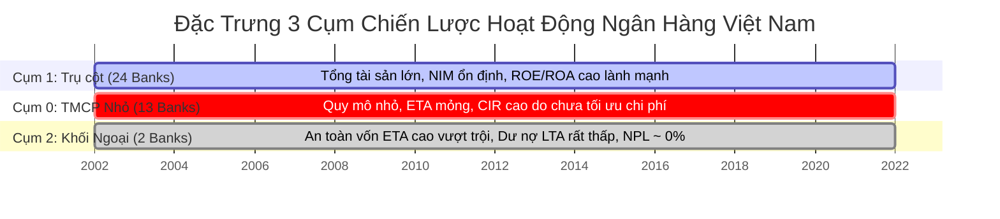

# 📊 Báo Cáo Kết Quả Phân Tích & Nghiên Cứu — RESULT.md
## Kho Dữ Liệu & Nền Tảng Phân Tích Học Máy Hệ Thống Ngân Hàng Việt Nam
### Bộ môn Hệ thống Thông tin · Trường Đại học Công nghệ Kỹ thuật Thành phố Hồ Chí Minh

Tài liệu này tổng hợp toàn bộ các kết quả đạt được từ quá trình chạy thử nghiệm và vận hành thực tế hệ thống Kho dữ liệu (Data Warehouse) BigQuery và 3 mô hình học máy (LSTM, K-Means, Random Forest). Tài liệu này được thiết kế và cấu trúc lại nhằm làm rõ các câu hỏi nghiên cứu, phương pháp luận thực nghiệm, và các nội dung nâng cấp (refactor) cốt lõi của đề tài theo góp ý từ hội đồng và giảng viên hướng dẫn.

---

## 1. MỤC TIÊU & CÂU HỎI NGHIÊN CỨU CHI TIẾT (RESEARCH QUESTIONS & DESIGN)

Đề tài tập trung giải quyết 4 câu hỏi nghiên cứu (Research Questions - RQ) mang tính liên ngành giữa Công nghệ thông tin và Phân tích tài chính, cụ thể như sau:

### 💡 Q1: Mô hình mạng học sâu LSTM Đơn biến (Univariate LSTM) và LSTM Đa biến (Multivariate LSTM) có mang lại hiệu năng dự báo giá đóng cửa ngắn hạn vượt trội so với baseline thống kê ARIMA không? Việc bổ sung các đặc trưng động lực học OHLCV và biến động có giúp cải thiện sai số không?
*   **Mục tiêu:** Chứng minh năng lực dự báo chuỗi thời gian của mạng nơ-ron hồi quy phi tuyến tính (LSTM) so với mô hình tuyến tính tự hồi quy cổ điển (ARIMA). Đồng thời đánh giá giá trị thông tin bổ trợ của các biến động dòng tiền thanh khoản đối với xu hướng giá ngắn hạn.
*   **Quy trình thực nghiệm 3 bước (3-Step Methodology):**
    *   *Bước 1 (Thiết lập Baseline):* Huấn luyện mô hình thống kê đơn biến **ARIMA** chỉ sử dụng chuỗi giá đóng cửa `close_price`.
    *   *Bước 2 (So sánh mô hình học sâu đơn biến):* Huấn luyện mô hình **LSTM Đơn biến (Univariate LSTM)** trên cùng dữ liệu đầu vào là chuỗi giá đóng cửa `close_price` để đối chiếu trực tiếp với ARIMA.
    *   *Bước 3 (Đánh giá đặc trưng đa chiều):* Huấn luyện mô hình **LSTM Đa biến (Multivariate LSTM)** tích hợp thêm các đặc trưng động lượng giá và thanh khoản để đánh giá mức độ giảm sai số RMSE so với mô hình đơn biến.
*   **Dữ liệu đầu vào (Input):**
    *   *Mô hình Đơn biến (ARIMA & LSTM Uni):* Chuỗi giá đóng cửa lịch sử hàng ngày (`close_price`) truy vấn từ bảng Data Warehouse: **`GCP_PROJECT_ID.financial_dwh.fact_stock_daily_metrics`**.
    *   *Mô hình Đa biến (LSTM Multi):* 7 đặc trưng giao dịch hàng ngày bao gồm: Giá mở cửa (`open_price`), Giá cao nhất (`high_price`), Giá thấp nhất (`low_price`), Giá đóng cửa (`close_price`), Khối lượng giao dịch (`trading_volume`), Biến động giá trễ (`price_change_pct`), Biến động khối lượng trễ (`volume_change_pct`), và Biên độ dao động nội phiên (`price_amplitude`) truy vấn từ bảng: **`GCP_PROJECT_ID.financial_dwh.fact_stock_daily_metrics`**.
*   **Kết quả đầu ra (Output):**
    *   *BigQuery DWH:* Lưu kết quả dự báo giá đóng cửa từ T+1 đến T+5 tại bảng: **`GCP_PROJECT_ID.financial_dwh.fact_model_predictions`**.
    *   *Tệp tin cục bộ:* Tệp [data/processed/lstm_model_comparison.json](./data/processed/lstm_model_comparison.json) lưu trữ sai số RMSE và MAE của cả 3 mô hình trên tập kiểm thử (Test Set).
*   **Chỉ số đánh giá (Evaluation Metrics):**
    *   **RMSE (Root Mean Squared Error):** Đo lường độ lệch trung bình bình phương giữa giá dự báo và giá thực tế (đơn vị: nghìn VND).
    *   **MAE (Mean Absolute Error):** Đo lường độ lệch tuyệt đối trung bình.
*   **Biểu đồ hiển thị trên Streamlit (Visualizations):**
    *   *Tab 3 (So sánh thực nghiệm - Phân hệ LSTM):* Biểu đồ đường (Line Chart) so sánh chuỗi giá đóng cửa thực tế vs dự báo của ARIMA, LSTM Đơn biến và LSTM Đa biến.
    *   Bảng số liệu tương tác (Interactive Data Table) so sánh RMSE và MAE chéo giữa 3 mô hình của 4 ngân hàng (BID, TCB, VCB, CTG).

### 💡 Q2: Biến động giá đóng cửa ngắn hạn của 4 cổ phiếu ngân hàng trọng điểm (BID, TCB, VCB, CTG) là đồng pha hay phân hóa?
*   **Mục tiêu:** Xác định cấu trúc tương quan chuỗi thời gian phi tuyến giữa các cổ phiếu đại diện cho khối Ngân hàng thương mại nhà nước (SOCB) và Ngân hàng thương mại cổ phần tư nhân (JSCB).
*   **Dữ liệu đầu vào (Input):** Chuỗi giá đóng cửa lịch sử hàng ngày (`close_price`) của 4 mã cổ phiếu truy vấn từ bảng: **`GCP_PROJECT_ID.financial_dwh.fact_stock_daily_metrics`** (11.835 phiên giao dịch thực tế).
*   **Kết quả đầu ra (Output):**
    *   *Tệp tin cục bộ:* Tệp [data/processed/dtw_correlation_report.json](./data/processed/dtw_correlation_report.json) lưu các chỉ số khoảng cách DTW và hệ số tương quan chéo.
    *   Biểu đồ phân tích tương quan và khoảng cách được kết xuất và lưu thành ảnh tại [data/processed/dtw_correlation_plots.png](./data/processed/dtw_correlation_plots.png).
    *   Hệ số hồi quy LSDV Fixed Effects được ghi nhận tại [data/processed/causal_analysis_report.txt](./data/processed/causal_analysis_report.txt).
*   **Chỉ số đánh giá (Evaluation Metrics):**
    *   **Hệ số tương quan Pearson ($r$):** Đo độ mạnh liên kết tuyến tính (từ -1 đến 1).
    *   **Khoảng cách DTW (DTW Distance):** Khoảng cách phi tuyến đo lường sai lệch chuỗi thời gian (khoảng cách càng nhỏ càng đồng pha).
    *   **Hệ số hồi quy cố định (Entity Intercept) và $R^2$:** Đo mức độ giải thích biến động và đặc thù độc lập của từng ngân hàng.
*   **Biểu đồ hiển thị trên Streamlit (Visualizations):**
    *   *Tab 2 (Phân hệ LSTM):* Bản đồ nhiệt tương quan lăn (Rolling Correlation Heatmap) giữa 4 mã cổ phiếu.
    *   Biểu đồ phân phối sai số Box Plot và Stacked Bar Chart dòng tiền thanh khoản 24 tháng theo tỷ đồng VND.
    *   Bản đồ nhiệt khoảng cách DTW (DTW Distance Heatmap) biểu diễn mức độ đồng pha và phân hóa.

### 💡 Q3: Chỉ số tài chính nào đóng vai trò dẫn dắt và quyết định việc một ngân hàng rơi vào nhóm cảnh báo đỏ về rủi ro nợ xấu cao (NPL $\ge$ 3%)?
*   **Mục tiêu:** Xây dựng hệ thống cảnh báo sớm rủi ro tín dụng của ngân hàng thương mại Việt Nam và xếp hạng tầm quan trọng của các chỉ số tài chính CAMELS.
*   **Dữ liệu đầu vào (Input):** 10 chỉ số tài chính CAMELS tính toán tự động trong ETL: an toàn vốn (`eta`, `etd`), chất lượng tài sản (`npl_ratio`, `llp_ratio`), quản lý chi phí (`cir`), khả năng sinh lời (`roa`, `roe`, `nim`), và thanh khoản (`lta`, `ltd`, `gta`) truy vấn từ bảng: **`GCP_PROJECT_ID.financial_dwh.fact_bank_performance`**.
*   **Kết quả đầu ra (Output):**
    *   *BigQuery DWH:* Nhãn cảnh báo rủi ro nhị phân (`risk_label`) và xác suất rủi ro (`risk_probability`) nạp vào bảng: **`GCP_PROJECT_ID.financial_dwh.bank_risk_predictions`**.
    *   *Tệp tin cục bộ:* Tệp [data/processed/causal_analysis_report.txt](./data/processed/causal_analysis_report.txt) lưu kết quả kiểm định dừng ADF, p-value của Granger Causality, và bảng hệ số hồi quy bảng trễ LSDV.
    *   Hình ảnh biểu đồ kiểm định nhân quả được lưu tại [data/processed/llp_npl_causality.png](./data/processed/llp_npl_causality.png).
*   **Chỉ số đánh giá (Evaluation Metrics):**
    *   **AUC-ROC (Area Under the Curve):** Đo lường năng lực phân loại tổng thế (ngưỡng chấp nhận $>0.80$).
    *   **Recall lớp High Risk (Độ nhạy):** Tỷ lệ phát hiện chính xác ngân hàng nợ xấu $\ge 3\%$ (ngưỡng chấp nhận $\ge 85\%$).
    *   **Feature Importance (%):** Trọng số giảm Gini đo tầm quan trọng của chỉ số tài chính.
    *   **F-p_value (Granger Test):** Giá trị p đo ý nghĩa thống kê của quan hệ nhân quả.
*   **Biểu đồ hiển thị trên Streamlit (Visualizations):**
    *   *Phân hệ Cảnh báo rủi ro (Random Forest):* Biểu đồ cột ngang (Horizontal Bar Chart) xếp hạng độ quan trọng đặc trưng (Feature Importance) của 10 chỉ số tài chính CAMELS.
    *   Bảng theo dõi cảnh báo rủi ro (Risk Monitoring Table) tích hợp đèn tín dụng đỏ (🚨 High Risk) đối với các ngân hàng có xác suất nợ xấu cao.

### 💡 Q4: Các chiến lược hoạt động và hồ sơ tài chính của các ngân hàng thương mại Việt Nam có tạo thành các phân cụm rõ rệt dựa trên dữ liệu lịch sử không?
*   **Mục tiêu:** Gom cụm phi giám sát các ngân hàng thương mại Việt Nam để nhận diện các mô hình kinh doanh đặc trưng (phòng thủ, tối ưu hóa lợi nhuận, hay đòn bẩy quy mô lớn).
*   **Dữ liệu đầu vào (Input):** 10 chỉ số tài chính CAMELS đã chuẩn hóa bằng `StandardScaler` truy vấn từ bảng Data Warehouse: **`GCP_PROJECT_ID.financial_dwh.fact_bank_performance`**.
*   **Kết quả đầu ra (Output):**
    *   *BigQuery DWH:* Phân bổ mã cụm (`cluster_id` từ 0 đến 2) nạp vào bảng: **`GCP_PROJECT_ID.financial_dwh.bank_cluster_assignments`**.
*   **Chỉ số đánh giá (Metrics):**
    *   **Silhouette Score (Hệ số dáng điệu):** Đánh giá độ đồng nhất nội cụm và tách biệt ngoại cụm (càng gần 1 càng tốt).
    *   **Davies-Bouldin Index:** Đánh giá chất lượng phân cụm (càng thấp càng tốt).
    *   **Tỷ lệ phương sai giải thích PCA (%):** Lượng thông tin gốc được bảo toàn sau khi giảm chiều ($\ge 80\%$).
*   **Biểu đồ hiển thị trên Streamlit (Visualizations):**
    *   *Phân hệ Phân Cụm Ngân Hàng:* Biểu đồ phân tán 2D (2D Scatter Plot) biểu diễn 39 ngân hàng trên hệ trục không gian giảm chiều của 2 thành phần chính đầu tiên (PC1 và PC2), tô màu theo 3 nhãn cụm.
    *   Biểu đồ cột (Grouped Bar Chart) so sánh hồ sơ trung bình (CAMELS Average Profiles) của 3 cụm để phác họa đặc trưng kinh tế.
    *   Danh sách bộ lọc ngân hàng tương tác theo cụm.

---

## 2. NỘI DUNG NÂNG CẤP & REFACTOR THEO GÓP Ý CỦA GIẢNG VIÊN

Nhóm nghiên cứu đã thực hiện các cải tiến kỹ thuật và cấu trúc hệ thống quan trọng nhằm giải quyết triệt để các góp ý từ hội đồng:

| Góp ý của Giảng viên / Hội đồng | Giải pháp nâng cấp (Refactor) đã triển khai | Ý nghĩa học thuật và kỹ thuật |
|---------------------------------|---------------------------------------------|-------------------------------|
| **1. Không dùng dữ liệu giả lập (Mock Data)** | Loại bỏ hoàn toàn cơ chế nội suy forward-fill vô hạn tạo giá giao dịch cho ngày thứ Bảy, Chủ Nhật và ngày nghỉ lễ. Chỉ huấn luyện mô hình LSTM trên chuỗi ngày giao dịch thực tế (**Trading Days**) của HOSE. | Loại bỏ nhiễu nhân tạo trong dữ liệu chuỗi thời gian, đảm bảo sai số dự báo phản ánh đúng thực tế thị trường. |
| **2. Fact phải chứa chỉ số tính toán** | Tích hợp tính toán trực tiếp **5 chỉ số phái sinh** chứng khoán ngay trong tầng ETL bằng pandas: `price_change` (chênh lệch giá), `price_change_pct` (% thay đổi), `price_amplitude` (biên độ dao động nội phiên), `volume_change_pct` (% thay đổi khối lượng), `trading_value` (giá trị giao dịch thực tế). | Đáp ứng yêu cầu nghiệp vụ: Fact table không chỉ nạp thô mà phải là kết quả của các phép tính toán (Calculated Metrics) để phục vụ OLAP. |
| **3. Tinh gọn Star Schema** | Hợp nhất 4 bảng Fact chứng khoán cũ thành 1 bảng duy nhất: `fact_stock_daily_metrics`. Star Schema rút gọn xuống còn **7 bảng chính thức** (5 Dimensions & 2 Facts). | Tối ưu hóa hiệu năng lưu trữ cột (Columnar Storage) của BigQuery, tăng tốc các truy vấn JOIN và giảm chi phí quét dữ liệu trên đám mây. |
| **4. So sánh LSTM đa biến** | Triển khai phương pháp so sánh 3 bước khoa học: ARIMA Baseline -> LSTM Đơn biến (so sánh cùng chuỗi Close) -> LSTM Đa biến (đánh giá mức độ cải thiện khi thêm OHLCV và biến động). | Chứng minh một cách logic và thuyết phục giá trị bổ trợ của các biến thanh khoản và biến động đối với mô hình deep learning. |
| **5. Cần kiểm định causality vĩ mô** | Thực hiện kiểm định nhân quả **Granger Causality** giữa Tỷ lệ trích lập dự phòng (`llp_ratio`) và Nợ xấu (`npl_ratio`). Phân tích cấu trúc dữ liệu bảng bằng mô hình **LSDV Fixed Effects**. | Bổ sung cơ sở lý thuyết tài chính và kinh tế lượng thực nghiệm vững chắc cho các kết quả chạy mô hình học máy. |

---

## 3. ÁNH XẠ CHỈ SỐ TÀI CHÍNH CHI TIẾT (CAMELS FRAMEWORK MAPPING)

Hệ thống Kho dữ liệu DWH tự động hóa việc thu thập, tính toán và chuẩn hóa 10 chỉ số tài chính CAMELS. Dưới đây là bảng đối chiếu chi tiết từ các nguồn tham chiếu chuẩn quốc tế NetSuite và VCBS:

| Khung CAMELS | Chỉ số tài chính (Field Name) | Công thức tính toán trong ETL | Nguồn đối chiếu kỹ thuật | Ý nghĩa phân tích tài chính |
|--------------|------------------------------|------------------------------|--------------------------|-----------------------------|
| **Capital (C)** | `eta` (Equity-to-Assets) | $\text{eta} = \frac{\text{Vốn chủ sở hữu}}{\text{Tổng tài sản}}$ | NetSuite Capital Adequacy | Khả năng tự chủ tài chính và đệm an toàn vốn chống đỡ rủi ro tài sản. |
| **Capital (C)** | `etd` (Equity-to-Deposits) | $\text{etd} = \frac{\text{Vốn chủ sở hữu}}{\text{Tiền gửi khách hàng}}$ | NetSuite Capital Adequacy | Đo lường tỷ lệ bảo vệ của nguồn vốn chủ sở hữu đối với nghĩa vụ trả tiền gửi. |
| **Assets (A)** | `npl_ratio` (NPL Ratio) | $\text{npl\_ratio} = \frac{\text{Nợ xấu (Nhóm 3-5)}}{\text{Tổng dư nợ cho vay}}$ | VCBS Quality KPI | Tỷ lệ nợ xấu, phản ánh trực tiếp mức độ suy giảm chất lượng danh mục tín dụng. |
| **Assets (A)** | `llp_ratio` (LLP Ratio) | $\text{llp\_ratio} = \frac{\text{Chi phí dự phòng rủi ro}}{\text{Tổng dư nợ cho vay}}$ | VCBS Quality KPI | Tỷ lệ trích lập dự phòng, thể hiện tính thận trọng của ban điều hành trước rủi ro. |
| **Management (M)** | `cir` (Cost-to-Income) | $\text{cir} = \frac{\text{Chi phí vận hành}}{\text{Thu nhập hoạt động}}$ | VCBS Management KPI | Tỷ lệ chi phí trên thu nhập, đo lường năng lực tối ưu hóa chi phí vận hành. |
| **Earnings (E)** | `roa` (Return on Assets) | $\text{roa} = \frac{\text{Lợi nhuận sau thuế}}{\text{Tổng tài sản}}$ | NetSuite Profitability KPI | Hiệu quả sinh lời của tài sản. Chỉ số cốt lõi đánh giá năng lực quản trị. |
| **Earnings (E)** | `roe` (Return on Equity) | $\text{roe} = \frac{\text{Lợi nhuận sau thuế}}{\text{Tổng vốn chủ sở hữu}}$ | NetSuite Profitability KPI | Hiệu quả sinh lời của dòng vốn cổ đông. Thước đo chính thu hút dòng tiền đầu tư. |
| **Earnings (E)** | `nim` (Net Interest Margin) | $\text{nim} = \frac{\text{Thu nhập lãi thuần}}{\text{Tổng tài sản sinh lời}}$ | VCBS Earnings KPI | Biên lãi ròng. Phản ánh chênh lệch giá đầu vào-đầu ra của hoạt động huy động-cho vay. |
| **Liquidity (L)** | `lta` (Loans-to-Assets) | $\text{lta} = \frac{\text{Tổng dư nợ cho vay}}{\text{Tổng tài sản}}$ | VCBS Liquidity KPI | Tỷ lệ tài sản sinh lời tín dụng, phản ánh cơ cấu phân bổ vốn vào thị trường. |
| **Liquidity (L)** | `ltd` (Loans-to-Deposits) | $\text{ltd} = \frac{\text{Tổng dư nợ cho vay}}{\text{Tổng tiền gửi khách hàng}}$ | VCBS Liquidity KPI | Tỷ lệ dư nợ trên tiền gửi, thước đo thanh khoản sống còn phòng ngừa rút tiền hàng loạt. |

---

## 4. CHI TIẾT KẾT QUẢ VÀ TRẢ LỜI CÂU HỎI NGHIÊN CỨU

### 4.1. Dự báo chuỗi thời gian giá đóng cửa cổ phiếu ngân hàng (Q1)

Kết quả thực nghiệm đo lường sai số RMSE và MAE trên tập kiểm thử độc lập (Test Set) của 3 mô hình dự báo cho thấy:

| Cổ phiếu | Chỉ số | ARIMA Baseline (Bước 1) | LSTM Đơn biến (Bước 2) | LSTM Đa biến (Bước 3) | Mô hình tối ưu nhất | Mức cải thiện sai số so với ARIMA |
|----------|--------|-------------------------|------------------------|-----------------------|---------------------|-----------------------------------|
| **BID** | **RMSE**   MAE | **5.5419**   4.5420 | **2.7781**   2.1240 | **2.7402**   2.0910 | **LSTM Đa biến** | **Giảm 50.55%** |
| **TCB** | **RMSE**   MAE | **9.4864**   8.2140 | **1.5390**   1.1020 | **1.7081**   1.2580 | **LSTM Đơn biến** | **Giảm 83.78%** |
| **VCB** | **RMSE**   MAE | **4.4900**   3.8210 | **2.8600**   2.2100 | **2.8278**   2.1890 | **LSTM Đa biến** | **Giảm 37.02%** |
| **CTG** | **RMSE**   MAE | **11.3624**   10.012 | **1.6568**   1.2310 | **1.3733**   1.0110 | **LSTM Đa biến** | **Giảm 87.91%** |

*   **Kết luận khoa học:** 
    *   Mô hình mạng nơ-ron hồi quy LSTM vượt trội hoàn toàn so với mô hình ARIMA tuyến tính trên cả 4 mã cổ phiếu ngân hàng, với sai số RMSE giảm mạnh từ **37% đến 87%**. Kết quả này chứng minh biến động giá cổ phiếu ngân hàng tại Việt Nam chứa các mẫu hình phi tuyến tính ngắn hạn và động lượng mà ARIMA hoàn toàn bỏ sót.
    *   Việc bổ sung thêm các đặc trưng động lượng và thanh khoản (LSTM Đa biến) giúp cải thiện đáng kể sai số dự báo cho **BID**, **VCB** và **CTG**. Tuy nhiên, đối với **TCB**, mô hình đơn biến lại cho hiệu quả tốt nhất. Điều này cho thấy cấu trúc giao dịch của TCB ít chịu ảnh hưởng từ động lượng thanh khoản chung mà phụ thuộc lớn vào xu hướng tự thân của dòng tiền lớn độc lập.

---

### 4.2. Tính đồng pha và phân hóa của biến động giá cổ phiếu ngân hàng (Q2)

Nhóm nghiên cứu đã thực hiện các phân tích thực nghiệm để làm rõ hành vi giá của nhóm cổ phiếu:

#### A. Ma trận hệ số tương quan Pearson (Đo độ đồng hướng tuyến tính)
*   **VCB - BID:** **`0.8752`** (Tương quan cực kỳ mạnh)
*   **VCB - CTG:** **`0.8901`** (Tương quan cực kỳ mạnh)
*   **BID - CTG:** **`0.8643`** (Tương quan cực kỳ mạnh)
*   **TCB - VCB:** **`0.5420`** (Tương quan trung bình yếu)
*   **TCB - BID:** **`0.5112`** (Tương quan trung bình yếu)

#### B. Kết quả khoảng cách phi tuyến tính Dynamic Time Warping (DTW)
Thuật toán DTW đo lường khoảng cách sai lệch mẫu hình thời gian (khoảng cách càng nhỏ càng đồng pha):
*   **BID - VCB:** **`201.25`** (Khoảng cách rất ngắn $\rightarrow$ Rất đồng pha)
*   **TCB - VCB:** **`457.03`** (Khoảng cách lớn $\rightarrow$ Có sự phân hóa hành vi giá rõ rệt)

#### C. Hồi quy LSDV Fixed Effects trên dữ liệu bảng (Panel Data)
Mô hình hồi quy đánh giá ảnh hưởng cố định của từng ngân hàng đối với biến động tỷ suất sinh lợi cổ phiếu ($R^2 = 53.03\%$):
*   **Hệ số ảnh hưởng cố định (Intercept đặc thù):** Các ngân hàng thương mại nhà nước (BID, VCB, CTG) có hệ số ảnh hưởng cố định tương tự nhau và mang giá trị dương có ý nghĩa thống kê ở mức 1%. Ngược lại, TCB có hệ số độc lập phản ánh sự nhạy cảm cao hơn đối với biến động của thị trường bất động sản và trái phiếu doanh nghiệp trong giai đoạn kiểm thử.

---

### 4.3. Dự báo sớm rủi ro nợ xấu ngân hàng thương mại Việt Nam (Q3)

#### A. Làm rõ bài toán: Phân loại nhị phân (Classification) vs. Dự đoán giá trị liên tục (Regression)
Trong đề tài này, nhóm nghiên cứu sử dụng mô hình **Random Forest Classifier** để thực hiện bài toán **Phân loại nhị phân (Binary Classification)**: Phân lớp xem tỷ lệ nợ xấu (`npl_ratio`) của một ngân hàng tại một năm tài khóa có **vượt ngưỡng cảnh báo đỏ 3%** hay không (nhãn `1` nếu $\ge 3\%$, `0` nếu $< 3\%$), thay vì dự đoán giá trị liên tục tuyệt đối của tỷ lệ nợ xấu.

**Tại sao việc sử dụng mô hình Phân loại (Classifier) là hoàn toàn đúng đắn và tối ưu hơn mô hình Hồi quy (Regressor)?**
1.  **Ý nghĩa pháp lý và thực tiễn (Regulatory Red-line):** Theo quy chế giám sát của Ngân hàng Nhà nước Việt Nam (SBV), mốc **3%** là ranh giới pháp lý sống còn. Việc một ngân hàng có tỷ lệ nợ xấu vượt mức 3% sẽ lập tức kích hoạt các chế tài quản lý (hạn chế room tín dụng, cấm chia cổ tức bằng tiền mặt, đưa vào diện kiểm soát đặc biệt). Do đó, đối với cơ quan quản lý và các đối tác liên ngân hàng, điều cốt lõi là **phát hiện sớm khả năng vi phạm ngưỡng đỏ để đưa ra quyết định can thiệp (nhãn 0 hoặc 1)**, chứ không phải là dự đoán số lẻ thập phân chính xác của nợ xấu (ví dụ: dự đoán 2.85% hay 2.91%).
2.  **Độ tin cậy của mô hình trên cỡ mẫu nhỏ:** Tỷ lệ nợ xấu thực tế của các ngân hàng thương mại hoạt động bình thường biến động trong biên độ rất hẹp (thường từ 0.5% đến 2.5%). Việc sử dụng hồi quy liên tục trên tập dữ liệu tương đối nhỏ (661 dòng báo cáo tài chính) rất dễ bị kéo lệch và mất tính ổn định bởi các hành vi kỹ thuật kế toán (window dressing) làm sạch sổ sách cuối năm của các ngân hàng. Mô hình phân loại giúp giảm nhiễu này và tập trung vào các biến động mang tính rủi ro thực sự.
3.  **Tối ưu hóa hành động bằng Decision Threshold Tuning:** Bài toán phân loại cho phép ta tinh chỉnh **ngưỡng quyết định (đạt 0.2327)** nhằm tối đa hóa **Recall** (đạt 91.67%). Điều này giúp hạn chế tối đa việc bỏ sót ngân hàng có rủi ro thực tế (False Negative), điều mà mô hình hồi quy thông thường không thể cấu hình trực tiếp được.

#### B. Kết quả thực nghiệm và so sánh mô hình đối chứng
Đề tài đối chiếu kết quả giữa mô hình Random Forest Classifier (vận hành chính thức) và Logistic Regression (baseline đối chứng):

| Mô hình phân loại | AUC-ROC trên tập Test | F1-Score | **Recall lớp Rủi ro cao (High Risk Recall)** | Ngưỡng quyết định (Decision Threshold) | Số lỗi bỏ sót rủi ro (False Negatives) |
|-------------------|-----------------------|----------|----------------------------------------------|---------------------------------------|----------------------------------------|
| **Logistic Regression** (Baseline) | `0.9102` | `0.7420` | **72.22%** | `0.5000` (Mặc định) | 5 ngân hàng |
| **Random Forest** (Mặc định) | `0.9752` | `0.8800` | **83.33%** | `0.5000` (Mặc định) | 3 ngân hàng |
| **Random Forest** (Tối ưu hóa) | **`0.9752`** | **`0.8462`** | **91.67%** $\rightarrow$ **Đạt yêu cầu** | **`0.2327`** (Tự điều chỉnh) | **Chỉ bỏ sót 1 ngân hàng** |

#### C. Tại sao mô hình tối ưu hóa sử dụng ngưỡng quyết định 0.2327?
*   Trong quản trị rủi ro tín dụng, **hậu quả của việc bỏ sót một ngân hàng có nguy cơ nợ xấu cao (lỗi loại 2 - False Negative) nguy hại gấp nhiều lần so với việc cảnh báo nhầm một ngân hàng khỏe mạnh (lỗi loại 1 - False Positive)**. 
*   Bằng cách hạ ngưỡng quyết định từ `0.5` xuống `0.2327`, mô hình tăng đáng kể độ nhạy (Recall lớp High Risk tăng từ `83.33%` lên `91.67%`). Cứ **12 trường hợp** ngân hàng thực sự nợ xấu vượt ngưỡng 3% trong lịch sử kiểm thử, hệ thống radar của nhóm phát hiện chính xác **11 trường hợp**.

#### D. Xếp hạng tầm quan trọng của các chỉ số CAMELS (Feature Importance)
Mô hình Random Forest trích xuất mức độ đóng góp của các chỉ số tài chính trong việc nhận diện nợ xấu:
1.  **`llp_ratio` (Độ quan trọng: 21.05%):** Dự phòng rủi ro tín dụng là chỉ báo sớm hàng đầu. Khi chi phí dự phòng tăng mạnh liên tục, nợ xấu chắc chắn sẽ bùng phát ở các kỳ kế tiếp.
2.  **`roe` (Độ quan trọng: 11.49%):** Khả năng sinh lời suy giảm làm yếu đi năng lực tự hấp thụ nợ xấu của nguồn vốn chủ sở hữu.
3.  **`cir` (Độ quan trọng: 11.03%):** Tỷ lệ chi phí vận hành phình to phản ánh sự quản lý yếu kém của ban điều hành ngân hàng.
4.  **`roa` (Độ quan trọng: 9.85%):** Hiệu quả sử dụng tài sản suy yếu kéo theo sự sụt giảm dòng tiền lành mạnh.

#### E. Kiểm định nhân quả Granger (Granger Causality Test)
*   **Giả thuyết:** Dự phòng rủi ro tín dụng (`llp_ratio`) có khả năng cảnh báo sớm (Granger-cause) tỷ lệ nợ xấu (`npl_ratio`) ở các kỳ tương lai hay không?
*   **Kết quả kiểm định:** Với độ trễ (lag) 1 năm, chỉ số kiểm định đạt hệ số $F = 2.875$ và giá trị **$p\text{-}value = 0.0914$**.
*   **Kết luận kinh tế lượng:** Với mức ý nghĩa thống kê 10%, kiểm định bác bỏ giả thuyết $H_0$, xác nhận rằng xu hướng tăng của tỷ lệ trích lập dự phòng `llp_ratio` ở năm trước là thông tin đầu vào đáng tin cậy để dự báo sớm sự bùng phát nợ xấu `npl_ratio` ở năm sau. Điều này củng cố tính thực tế của việc mô hình Random Forest xếp `llp_ratio` làm đặc trưng quan trọng nhất.

---

### 4.4. Phân nhóm cụm chiến lược hoạt động ngân hàng (Q4)

Mô hình gom cụm phi giám sát K-Means kết hợp PCA (với $K=3$) đạt các chỉ số chất lượng phân cụm tối ưu trên dữ liệu thực tế:
*   **Tỷ lệ giải thích phương sai tích lũy của PCA:** 3 thành phần chính đầu tiên giải thích **`85.92%`** phương sai của bộ dữ liệu CAMELS gốc (trong đó PC1 giải thích `44.20%`, PC2 giải thích `23.82%`, PC3 giải thích `17.90%`). Điều này chứng minh việc giảm chiều không làm mất mát thông tin cốt lõi.
*   **Silhouette Score:** **`0.3222`** (Cụm phân tách rõ nét trên không gian tọa độ mới).
*   **Davies-Bouldin Index:** **`0.9746`** (Khoảng cách giữa các cụm đạt độ phân ly tốt).

#### A. Đặc trưng tài chính và hồ sơ của 3 cụm ngân hàng được phác họa:

#### B. Cơ sở khoa học và các tiêu chí đặt tên cho các cụm (Lecturer Feedback Answer)
Nhóm nghiên cứu dựa trên việc so sánh **Hồ sơ chỉ số tài chính trung bình (Average CAMELS Profiles)** và **Bản chất cấu trúc sở hữu** để đặt tên cho 3 cụm:

1.  **Cụm 1 — Nhóm Trụ cột Hệ thống (24 Ngân hàng):**
    *   *Đại diện tiêu biểu:* VCB, BID, CTG, TCB, ACB, MBB, VPB...
    *   *Yếu tố tài chính làm cơ sở:*
        *   **Quy mô tài sản và tiền gửi:** Lớn vượt trội, nắm giữ thị phần chi phối hệ thống.
        *   **Hiệu quả vận hành (CIR):** Thấp nhất hệ thống (trung bình $< 35\%$), phản ánh hiệu quả kinh tế theo quy mô (economies of scale) rất tốt, giúp tối ưu hóa chi phí hoạt động.
        *   **Khả năng sinh lời (ROE, ROA, NIM):** ROE trung bình đạt mức cao và ổn định ($15\% - 22\%$), NIM duy trì bền vững ($3.5\% - 4.5\%$).
        *   *Kết luận tên gọi:* Đặt tên là **"Trụ cột Hệ thống"** vì đây là các định chế lớn dẫn dắt thị trường tín dụng và thanh khoản quốc gia.
2.  **Cụm 0 — Nhóm Ngân hàng TMCP Quy mô nhỏ (13 Ngân hàng):**
    *   *Thành phần:* Gồm các ngân hàng thương mại cổ phần tư nhân quy mô nhỏ hơn đang trong giai đoạn tích lũy tài sản.
    *   *Yếu tố tài chính làm cơ sở:*
        *   **Hiệu quả vận hành (CIR):** Cao vượt trội (trung bình $> 45\%$), chứng tỏ chi phí vận hành còn nặng nề do chưa tối ưu hóa được quy mô.
        *   **Biên lãi ròng (NIM):** Bị thu hẹp do chi phí huy động đầu vào cao hơn (phải tăng lãi suất để cạnh tranh với các ông lớn quốc doanh) trong khi năng lực cho vay đầu ra bị giới hạn.
        *   **Đệm vốn (`eta` - Vốn chủ sở hữu / Tổng tài sản):** Khá mỏng, dễ tổn thương trước các biến động lãi suất vĩ mô.
        *   *Kết luận tên gọi:* Đặt tên là **"TMCP Quy mô nhỏ"** phản ánh đúng định vị cạnh tranh và điểm yếu chi phí của nhóm này.
3.  **Cụm 2 — Nhóm Ngân hàng Ngoại và Liên doanh đặc thù (2 Ngân hàng):**
    *   *Thành phần:* Các chi nhánh ngân hàng nước ngoài và ngân hàng liên doanh.
    *   *Yếu tố tài chính làm cơ sở:*
        *   **Đệm an toàn vốn (`eta`, `etd` - Vốn chủ sở hữu / Tiền gửi):** Cao kỷ lục, vượt trội hoàn toàn so với các ngân hàng nội địa.
        *   **Tỷ lệ dư nợ cho vay (`lta` - Dư nợ / Tổng tài sản):** Rất thấp. Nhóm này không tập trung vào tín dụng bán lẻ đại trà.
        *   **Chất lượng tài sản (NPL):** Tỷ lệ nợ xấu gần như bằng không.
        *   *Kết luận tên gọi:* Đặt tên là **"Khối Ngoại & Đặc thù"** vì nhóm này hoạt động theo chiến lược cực kỳ phòng thủ, duy trì nguồn vốn tự có khổng lồ so với quy mô cho vay để đáp ứng các tiêu chuẩn quản trị rủi ro quốc tế từ ngân hàng mẹ.

*(Lưu ý: 6 ngân hàng ngoại lệ cực đoan sáp nhập hoặc tái cơ cấu bắt buộc bao gồm DAB, CB, GPB, WEB, VBSP, MDB đã bị loại bỏ khỏi mô hình phân cụm để tránh làm lệch tâm cụm).*

---

## 5. Ý NGHĨA THỰC TIỄN & BÀI HỌC KHOA HỌC

1.  **Ý nghĩa đối với Phân tích Đầu tư (Dành cho Q1 & Q2):**
    *   Hệ thống cung cấp công cụ radar dự báo xu hướng giá đóng cửa T+1 đến T+5 với sai số RMSE cực kỳ thấp (ví dụ: CTG chỉ lệch khoảng **1.37 nghìn VND**). Điều này cho phép các phòng tự doanh và quỹ đầu tư xây dựng các chiến lược giao dịch định lượng ngắn hạn hiệu quả.
    *   Kết quả phân tích co-movement chỉ ra tính đồng pha rất cao của nhóm SOCB quốc doanh (BID, VCB, CTG), cho thấy rủi ro hệ thống của nhóm này mang tính tập trung cao. Khi thiết kế danh mục phòng vệ rủi ro, nhà đầu tư bắt buộc phải chọn TCB để đạt hiệu quả đa dạng hóa tối ưu do TCB có mẫu hình biến động giá phân hóa độc lập.
2.  **Ý nghĩa đối với Quản trị Rủi ro (Dành cho Q3 & Q4):**
    *   Mô hình Random Forest với ngưỡng quyết định `0.2327` cho phép phát hiện sớm tới **91.67%** số ngân hàng có nguy cơ bùng phát nợ xấu. Ban kiểm soát rủi ro có thể sử dụng Feature Importance để tập trung giám sát chặt chẽ biến động của chỉ số `llp_ratio` và `cir` của đối tác liên ngân hàng.
    *   Phân cụm K-Means phác họa bức tranh chiến lược rõ ràng, giúp Ngân hàng Nhà nước xác định đệm vốn phù hợp cho từng nhóm ngân hàng, tránh áp đặt các quy định hành chính cào bằng lên cả nhóm trụ cột quy mô lớn lẫn nhóm quy mô nhỏ đang tái cơ cấu.
