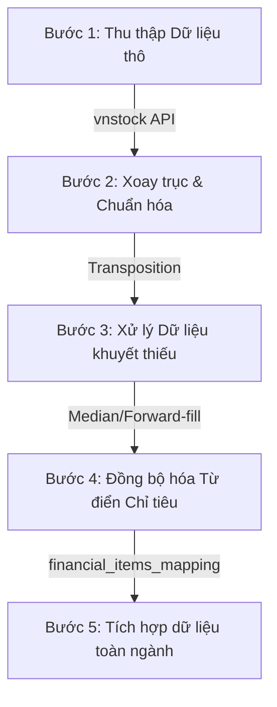

# Khung Quy trình Khai thác & Chuẩn hóa Dữ liệu Ngân hàng (Data Ingestion & Standardization Framework)

## 1. Mục tiêu (Objective)

Tài liệu này định nghĩa **Khung quy trình chuẩn (SOP - Standard Operating Procedure)** cho việc khai phá, làm sạch, xoay trục và tích hợp dữ liệu tài chính của các ngân hàng thương mại Việt Nam. Quy trình này áp dụng cho bất kỳ ngân hàng nào được bổ sung vào hệ thống trong tương lai nhằm đảm bảo tính đồng nhất của Kho dữ liệu (DWH) và làm đầu vào đáng tin cậy cho các mô hình Machine Learning.

---

## 2. Quy trình 5 Bước Khai phá & Tích hợp Dữ liệu (5-Step Ingestion & Integration Process)



### Bước 1: Thu thập Dữ liệu thô (Data Collection)
*   **Nguồn dữ liệu**: Sử dụng thư viện `vnstock` thông qua nguồn API **`vci`** để đảm bảo tính ổn định và đầy đủ thông tin báo cáo tài chính của ngân hàng.
*   **Các thành phần dữ liệu cần tải**:
    1.  **Lịch sử giá cổ phiếu (Daily Stock Price)**: Giá Open, High, Low, Close và Volume giao dịch hàng ngày.
    2.  **Báo cáo tài chính (Financial Statements)**: Bảng cân đối kế toán (Balance Sheet), Báo cáo kết quả kinh doanh (Income Statement) và Báo cáo lưu chuyên tiền tệ (Cash Flow) ở cả hai chế độ **Năm (Annual)** và **Quý (Quarterly)**.
    3.  **Chỉ số tài chính tính sẵn (Financial Ratios)**: Tải ở chế độ thô (raw mode) để lấy các chỉ số biên sinh lời, hiệu quả vận hành và thanh khoản.
*   **Chiến thuật tải phân đoạn (Chunking)**:
    *   Do giới hạn API của bản miễn phí, dữ liệu lịch sử giá phải được tải thành 2 phân đoạn thời gian (Phân đoạn 1: `2014-01-01` đến `2020-12-31`, Phân đoạn 2: `2021-01-01` đến ngày hiện tại) rồi gộp lại, loại bỏ trùng lặp bằng cột ngày (`time`).

### Bước 2: Xoay trục & Chuẩn hóa Cấu trúc (Transposition & Standardization)
*   **Xoay trục dọc chuỗi thời gian (Transposition)**:
    *   Báo cáo tài chính thô từ API trả về dạng bảng ngang (các chỉ tiêu nằm ở cột, các mốc thời gian nằm ở hàng).
    *   Quy trình bắt buộc xoay trục (Transpose) để **Chỉ tiêu trở thành Cột** và **Mốc thời gian (Period) trở thành Hàng**.
*   **Chuẩn hóa cột mốc thời gian (`period`)**:
    *   Chu kỳ Năm: Định dạng là chuỗi `YYYY` (Ví dụ: `2024`).
    *   Chu kỳ Quý: Định dạng là chuỗi `YYYY-QX` (Ví dụ: `2024-Q1`).
*   **Chuẩn hóa tên cột (Column Naming)**:
    *   Đổi toàn bộ tên cột chỉ tiêu sang định dạng chữ thường viết liền bằng dấu gạch dưới (`snake_case`).
    *   Loại bỏ dấu tiếng Việt, ký tự đặc biệt, khoảng trắng thừa và đơn vị đo (ví dụ: đổi `Tiền gửi khách hàng (tỷ đồng)` thành `tien_gui_khach_hang`).

### Bước 3: Xử lý Chất lượng Dữ liệu & Giá trị Khuyết thiếu (Data Quality & Imputation)
*   **Dữ liệu chứng khoán (Stock Price)**:
    *   Áp dụng phương pháp **Forward-fill** với giới hạn tối đa 1 phiên (`limit=1`) đối với giá đóng cửa để xử lý các ngày mất dữ liệu kỹ thuật.
    *   Nếu giá đóng cửa (`close_price`) bị rỗng hoàn toàn sau khi xử lý, bắt buộc loại bỏ hàng đó và log cảnh báo lỗi.
*   **Dữ liệu báo cáo tài chính (Financial Statements)**:
    *   Áp dụng phương pháp **Median Imputation (Nội suy Trung vị)**: Impute các chỉ số tài chính bằng giá trị trung vị của chính ngân hàng đó trong giai đoạn 2006–2022.
    *   Nếu ngân hàng mới không có đủ dữ liệu lịch sử, sử dụng trung vị toàn ngành (Global Median).
    *   Tạo thêm cột cờ boolean `is_imputed` và đánh dấu `True` đối với các dòng có chỉ tiêu tài chính được điền khuyết thiếu để phục vụ kiểm toán dữ liệu.
    *   **Tuyệt đối không sử dụng forward-fill** đối với tỷ lệ nợ xấu (`npl_ratio`) vì đây là biến mục tiêu của mô hình phân loại.

### Bước 4: Đồng bộ hóa Từ điển Chỉ tiêu (Metadata Mapping)
*   Mỗi ngân hàng có thể có các chỉ tiêu tài chính với cách đặt tên hoặc dịch nghĩa khác nhau nhẹ.
*   Sau khi trích xuất, danh sách mã chỉ tiêu (`item_id`) và tên tiếng Việt (`item_vi`) phải được đối chiếu và cập nhật vào file từ điển dùng chung **`data/processed/financial_items_mapping.csv`** để đảm bảo tính nhất quán trên toàn hệ thống DWH.

### Bước 5: Tích hợp Dữ liệu Toàn ngành (Sector Integration)
*   **Ánh xạ mã định danh (Entity Mapping)**:
    *   Bản Excel toàn ngành lưu mã ngân hàng theo chuẩn riêng (ví dụ: `BIDV`, `VCB`, `TCB`).
    *   Dữ liệu chứng khoán lưu theo mã ticker 3 ký tự (ví dụ: `BID`, `VCB`, `TCB`).
    *   *Quy tắc:* Thiết lập bảng ánh xạ mã (Lookup Dict) trước khi thực hiện các lệnh ghép nối (JOIN/MERGE).
*   **Ghép nối chuỗi thời gian (Time-series Merge)**:
    *   Nối tiếp dữ liệu lịch sử toàn ngành từ tệp Excel (giai đoạn 2002–2022) với dữ liệu cập nhật mới trích xuất từ API (giai đoạn 2023–nay).
    *   Đảm bảo các công thức tính toán chỉ số tài chính cốt lõi (NIM, ROA, ROE, NPL, LDR) đồng nhất về định nghĩa và đơn vị đo (tỷ lệ phần trăm dạng thập phân từ `0.0` đến `1.0`).

---

## 3. Tiêu chuẩn Thư mục Lưu trữ (Directory Standard)

Mọi tệp dữ liệu phát sinh của các ngân hàng tiếp theo phải được lưu trữ nghiêm ngặt theo phân cấp:

```text
data/
├── raw/                                         # Dữ liệu thô tải tay hoặc Excel gốc (không commit)
│   └── VN banks dataset (updated August 2023).xlsx
├── processed/                                   # Dữ liệu sạch (được commit lên Git)
│   ├── financial_items_mapping.csv              # Từ điển chỉ tiêu dùng chung
│   ├── <bank_code_1>/                           # Thư mục con của ngân hàng 1 (VD: bid/)
│   │   ├── <bank_code>_stock_history.csv
│   │   ├── <bank_code>_balance_sheet_annual.csv
│   │   └── ...
│   ├── <bank_code_2>/                           # Thư mục con của ngân hàng 2 (VD: tcb/)
│   │   ├── <bank_code>_stock_history.csv
│   │   └── ...
```

---

## 4. Danh sách Kiểm tra & Xác minh Dữ liệu (Validation Checklist)

Trước khi commit dữ liệu của một ngân hàng mới lên Git, lập trình viên phải chạy script xác minh tự động (`validate_integrity.py`) và kiểm tra các tiêu chuẩn sau:

- `[ ]` **Kiểm tra tính toàn vẹn (Referential Integrity)**: Toàn bộ khóa ngày `date_key` trong các bảng Fact phải tham chiếu thành công đến một dòng tồn tại trong `dim_date`.
- `[ ]` **Kiểm tra biên trị chỉ số**: Các cột tỷ lệ như `npl_ratio`, `roa`, `roe`, `nim` phải nằm trong khoảng hợp lý (không được âm hoặc vượt quá 100% trừ trường hợp đặc biệt được log cảnh báo).
- `[ ]` **Kiểm tra giá trị chứng khoán**: Giá đóng cửa (`close_price`) bắt buộc phải lớn hơn 0.
- `[ ]` **Kiểm tra trùng lặp (Duplicate Check)**: Không có dòng dữ liệu nào bị trùng lặp khóa chính (mã ngân hàng + mốc thời gian).
