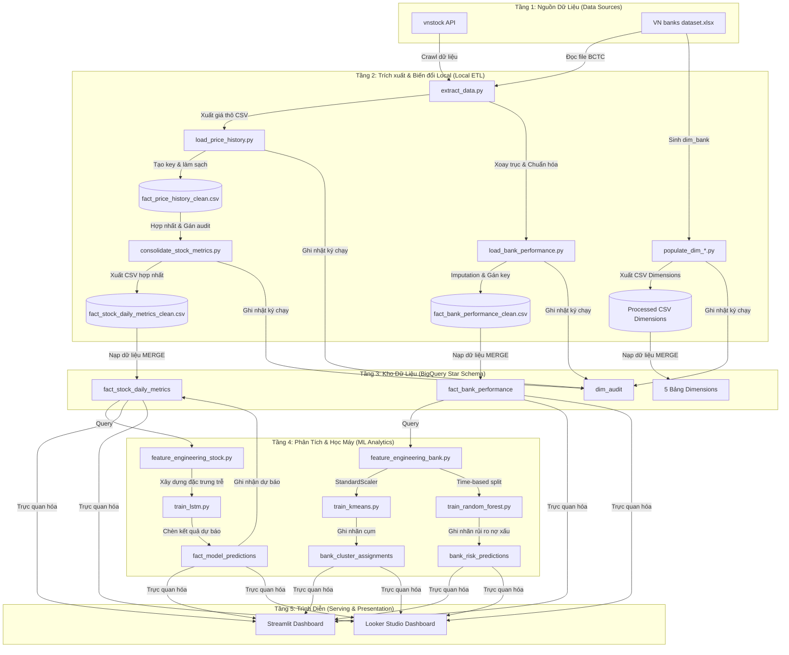

# Đặc Tả Luồng Dữ Liệu Dự Án (Data Lineage & Data Flow)

Tài liệu này làm rõ toàn bộ đường đi của dữ liệu (Data Lineage) trong hệ thống: từ khâu thu thập nguồn thô, tiền xử lý và lưu trữ cục bộ, nạp vào Kho dữ liệu (DWH) Star Schema trên Google BigQuery, huấn luyện các mô hình Machine Learning (ML), cho đến khâu trực quan hóa trên Dashboard.

---

## 1. Sơ đồ luồng dữ liệu tổng thể (End-to-End Data Flow)

Biểu đồ dưới đây thể hiện toàn bộ kiến trúc 5 tầng của hệ thống và cách dữ liệu di chuyển qua từng tầng:

---

## 2. Chi tiết các luồng dữ liệu con (Sub-Data Flow Lineage)

### 2.1. Luồng dữ liệu Chứng khoán (Stock Price History Flow)

Luồng này phục vụ cho bài toán dự báo chuỗi thời gian ngắn hạn (Q1 & Q2):

1. **Trích xuất (Extract):** Tệp `extract_data.py` gọi API `vnstock` để tải dữ liệu lịch sử giá của 4 mã ngân hàng (BID, TCB, VCB, CTG) từ ngày 01-01-2014 đến hiện tại. Kết quả được lưu cục bộ dưới dạng các tệp CSV như `bid_stock_history.csv` tại thư mục `data/processed/{symbol}/`.
2. **Biến đổi (Transform - Load Price History):** Tệp `load_price_history.py` đọc dữ liệu thô, loại bỏ các dòng bị khuyết thiếu giá đóng cửa `close_price`. Sau đó, thực hiện chuyển đổi định dạng ngày tháng thành khóa thay thế `date_key` (INT64 dạng `YYYYMMDD`) và mã cổ phiếu thành `stock_key` (BID = 1, TCB = 2, VCB = 3, CTG = 4). Kết quả lưu thành `fact_price_history_clean.csv`.
3. **Hợp nhất (Consolidate Stock Metrics):** Tệp `consolidate_stock_metrics.py` đọc tệp sạch, loại bỏ trùng lặp, tính toán và thêm thông số hệ thống (`_created_at`, `_updated_at`, `_source_file`), rồi xuất ra tệp `fact_stock_daily_metrics_clean.csv`.
4. **Nạp Kho (Load to DWH):** Tệp `load_to_bigquery.py` đẩy dữ liệu từ CSV sạch lên bảng đích `fact_stock_daily_metrics` của BigQuery thông qua API Load Job bằng phương pháp `MERGE` (nếu có billing) hoặc `WRITE_APPEND` (chế độ Sandbox).
5. **Đặc trưng ML (Feature Engineering):** Tệp `feature_engineering_stock.py` truy vấn bảng `fact_stock_daily_metrics` để lấy chuỗi dữ liệu lịch sử, tính toán hai đặc trưng động lực học là `% thay đổi giá` (`price_change_pct`) và `% thay đổi khối lượng` (`volume_change_pct`), đồng thời tạo các chuỗi trượt (lags) 5 ngày.
6. **Mô hình & Dự báo (LSTM Predictions):** Tệp `train_lstm.py` sử dụng chuỗi đặc trưng trên để dự đoán giá đóng cửa từ T+1 đến T+5. Kết quả dự báo được chèn vào bảng `fact_model_predictions` trên BigQuery.
7. **Trình diễn (Dashboard):** Streamlit và Looker Studio truy vấn đồng thời từ bảng `fact_stock_daily_metrics` (giá thực tế) và `fact_model_predictions` (giá dự báo) qua các khóa liên kết `(date_key, stock_key)` để vẽ biểu đồ so sánh.

---

### 2.2. Luồng dữ liệu Ngân hàng & Phân cụm (Bank Performance & Clustering Flow)

Luồng này phục vụ cho bài toán phân cụm chiến lược hoạt động (Q4):

1. **Trích xuất (Extract):** Tệp `extract_data.py` trích xuất bảng cân đối kế toán và báo cáo kết quả hoạt động kinh doanh từ tệp Excel thô `data/raw/VN banks dataset (updated August 2023).xlsx`, thực hiện xoay trục dữ liệu để chuyển từ định dạng cột báo cáo năm thành định dạng chuỗi dọc và xuất ra tệp CSV trung gian.
2. **Biến đổi & Imputation (Transform - Bank Performance):** Tệp `load_bank_performance.py` thực hiện xử lý giá trị khuyết thiếu trong giai đoạn 2002–2005 bằng phương pháp nội suy trung vị theo từng ngân hàng, tính toán 47 tỷ số tài chính CAMELS vĩ mô, gán khóa `bank_key` (tra cứu từ `dim_bank`) và `date_key`, xuất ra tệp `fact_bank_performance_clean.csv`.
3. **Nạp Kho (Load to DWH):** Dữ liệu được nạp vào bảng `fact_bank_performance` trên BigQuery.
4. **Đặc trưng ML (Feature Engineering):** Tệp `feature_engineering_bank.py` truy vấn dữ liệu từ bảng thực tế, kết nối với bảng chiều `dim_bank` để lọc bỏ các ngân hàng ngoại lai (CB, VBSP, DAB, GPB, WEB, MDB - tổng cộng còn 39 ngân hàng) và sử dụng `StandardScaler` để đưa các tỷ số tài chính về dạng chuẩn hóa (mean=0, std=1).
5. **Phân cụm (K-Means Clustering):** Tệp `train_kmeans.py` thực hiện giảm chiều dữ liệu bằng PCA (giữ lại $\ge$ 80% phương sai) và gom cụm K-Means ($K=3$). Nhãn cụm (`cluster_id` từ 0 đến 2) được ghi ngược về bảng `bank_cluster_assignments` trên BigQuery.
6. **Trình diễn (Dashboard):** Dashboard truy vấn bảng kết quả phân cụm kết nối với bảng chiều `dim_bank` để vẽ biểu đồ phân tán PCA 2D và biểu đồ so sánh trị trung bình CAMELS giữa các cụm.

---

### 2.3. Luồng dữ liệu Phân loại rủi ro (Credit Risk Classification Flow)

Luồng này phục vụ bài toán cảnh báo sớm nợ xấu ngân hàng (Q3):

1. **Trích xuất & Biến đổi:** Thừa hưởng dữ liệu sạch từ bảng `fact_bank_performance` trên BigQuery.
2. **Gán nhãn rủi ro (Labeling):** Mô hình `train_random_forest.py` tự động gán nhãn rủi ro tín dụng (`risk_label`) cho từng bản ghi năm: bằng `1` (Nguy cơ cao) nếu `npl_ratio` $\ge$ 0.03 (3%), ngược lại là `0` (Lành mạnh).
3. **Huấn luyện & Đánh giá (Random Forest):** Dữ liệu được chia tập huấn luyện và kiểm thử theo thời gian (Time-based split: Train < 2018, Test $\ge$ 2018). Mô hình Random Forest Classifier được huấn luyện với trọng số cân bằng nhãn (`class_weight='balanced'`).
4. **Ghi kết quả (Output Log):** Nhãn dự đoán rủi ro và xác suất dự đoán được ghi vào bảng `bank_risk_predictions` trên BigQuery. Độ quan trọng của các biến tài chính (Feature Importance) được xuất ra tệp ảnh nằm trong thư mục `reports/figures/`.
5. **Trình diễn (Dashboard):** Dashboard hiển thị cơ cấu rủi ro qua biểu đồ tròn, vẽ biểu đồ thanh ngang độ quan trọng các biến số tài chính của mô hình, và liệt kê bảng cảnh báo đỏ cho các ngân hàng được dự đoán có rủi ro cao.

---

## 3. Ánh xạ luồng dữ liệu cấp thuộc tính (Column-Level Lineage Mapping)

Bảng dưới đây ánh xạ các chỉ số tài chính và chứng khoán cốt lõi qua toàn bộ vòng đời dữ liệu trong hệ thống:

| Thuộc tính ban đầu (Source) | Tệp Excel/API nguồn | Bảng dữ liệu đích DWH | Mô hình ML tiêu thụ | Chỉ số hiển thị trên Dashboard |
|-----------------------------|--------------------|------------------------|---------------------|--------------------------------|
| `Close / Đóng cửa` | vnstock API | `fact_stock_daily_metrics.close_price` | `train_lstm.py` (Biến mục tiêu Y) | Biểu đồ đường Giá thực tế vs Giá dự báo |
| `Volume / Khối lượng` | vnstock API | `fact_stock_daily_metrics.trading_volume` | `train_lstm.py` (Biến X đa biến) | Khối lượng khớp lệnh hàng ngày |
| `Total assets / Tổng tài sản` | `VN banks dataset.xlsx` | `fact_bank_performance.tassets` | `train_kmeans.py` (Quy mô ngân hàng) | Tổng tài sản các năm |
| `NPL / Nợ xấu nhóm 3-5` | `VN banks dataset.xlsx` | `fact_bank_performance.npl` | `train_random_forest.py` (Dùng tính NPL Ratio) | Quy mô nợ xấu tuyệt đối |
| `NPL Ratio / Tỷ lệ nợ xấu` | *Tính toán trong Transform* | `fact_bank_performance.npl_ratio` | `train_random_forest.py` (Tạo nhãn mục tiêu rủi ro $\ge$ 3%) | Biểu đồ xu hướng nợ xấu của các ngân hàng |
| `LLP / Trích lập dự phòng` | `VN banks dataset.xlsx` | `fact_bank_performance.llp` | `train_random_forest.py` (Tính LLP Ratio làm biến X) | Trích lập dự phòng rủi ro |
| `LLP Ratio` | *Tính toán trong Transform* | `fact_bank_performance.llp_ratio` | `train_random_forest.py` (Đặc trưng quan trọng nhất - 21.05%) | Kiểm định Granger và Hồi quy LLP $\rightarrow$ NPL |
| `Equity / Vốn CSH` | `VN banks dataset.xlsx` | `fact_bank_performance.equity` | `train_kmeans.py` (Chỉ số an toàn vốn ETA) | Vốn chủ sở hữu ngân hàng |

---

## 4. Luồng kiểm toán hệ thống (Audit Lineage Trail)

Hệ thống ghi nhận lịch sử xử lý dữ liệu và kiểm soát chất lượng qua cơ chế khóa ngoại và trường thông tin kiểm toán:

1. **Khởi tạo chạy Pipeline:** Khi luồng ETL được kích hoạt, một bản ghi mới với mã định danh ngẫu nhiên UUID (`run_id`) được chèn vào bảng chiều `dim_audit` với trạng thái ban đầu là `RUNNING`. Khóa chính tự tăng `audit_key` được sinh ra cho lượt chạy này.
2. **Gắn Auditing Metadata:** Trong bước biến đổi (Transform) của mọi bảng sự kiện (Fact) và bảng chiều (Dimension), hệ thống tự động gắn thêm:
   - `_created_at`: Thời gian bản ghi được tạo ra trong hệ thống.
   - `_updated_at`: Thời gian bản ghi được cập nhật.
   - `_source_file`: Tên của tệp dữ liệu Excel thô hoặc API nguồn cung cấp dòng dữ liệu đó.
   - `audit_key`: Khóa ngoại trỏ về lượt chạy tương ứng trong bảng `dim_audit`.
3. **Kết thúc chạy Pipeline:** Sau khi toàn bộ các tác vụ nạp (Load) hoàn tất thành công và bước kiểm tra DQ (Data Quality) thông qua script `validate_integrity.py` đạt 0 lỗi, bản ghi audit tương ứng trong `dim_audit` sẽ được cập nhật trạng thái thành `SUCCESS` cùng số lượng dòng đã xử lý thực tế (`rows_processed`). Nếu có bất kỳ lỗi nào xảy ra làm luồng chạy bị dừng, trạng thái sẽ ghi nhận là `FAILED` kèm thông tin lỗi, phục vụ đắc lực cho công tác gỡ lỗi (debugging) hệ thống.
