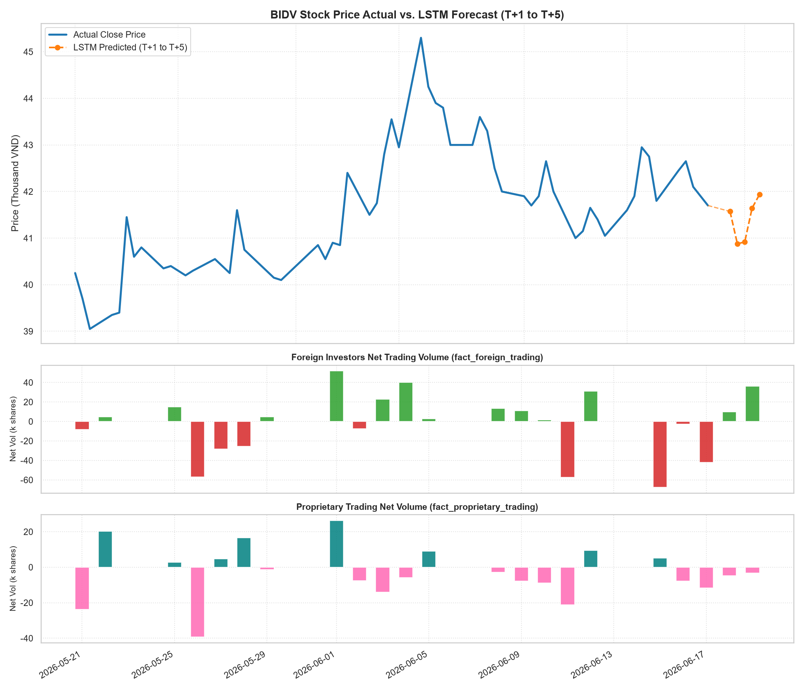
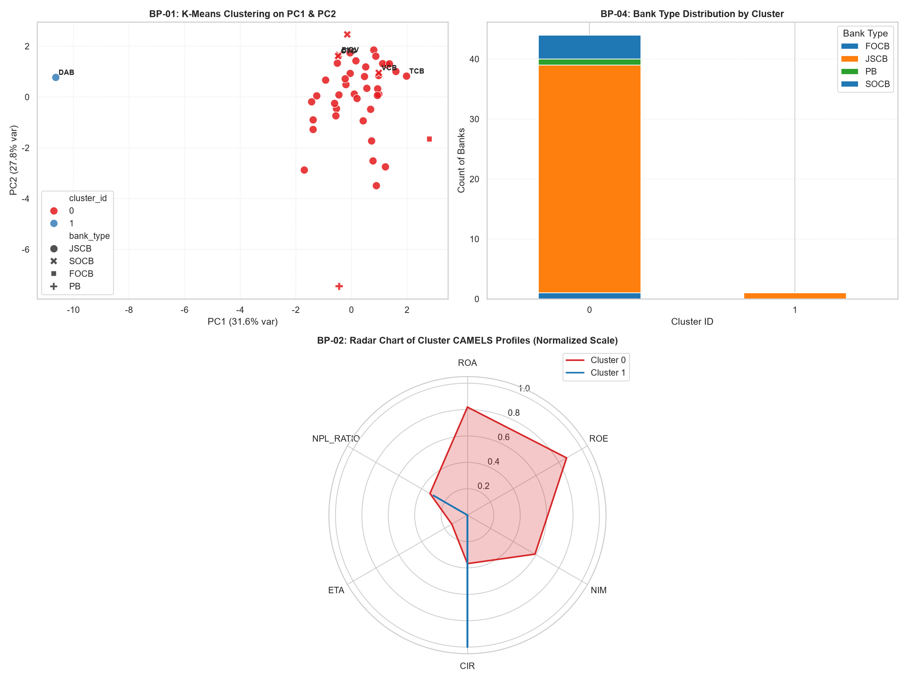
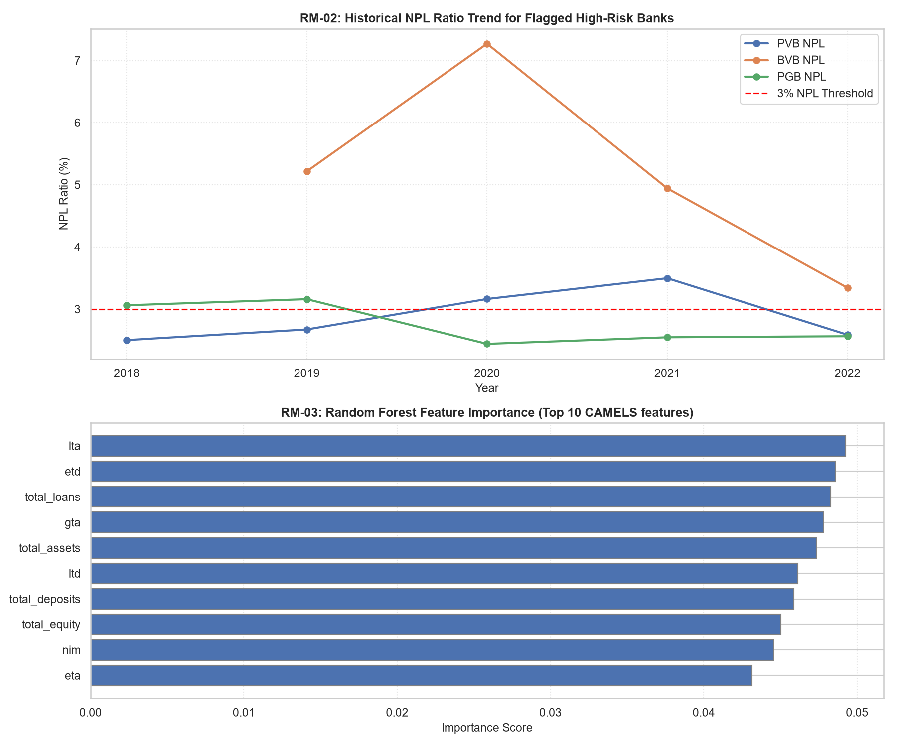

# Báo Cáo Phân Tích Ý Nghĩa Nghiệp Vụ Các Biểu Đồ & Tiến Độ ML Cục Bộ

> **Dự án**: Hệ thống Data Warehouse & Phân Tích Học Máy Hệ Thống Ngân Hàng Việt Nam  
> **Tác giả**: Nhóm Phát triển Học máy & Kỹ thuật Dữ liệu (Track B & C)  
> **Bản quyền**: Nhóm 2 · HCMUTE HK6  
> **Tài liệu lưu tại**: `docs/process/bao_cao_dashboard_ml_local.md`

---

## 1. Giới Thiệu Chung
Báo cáo này trình bày ý nghĩa nghiệp vụ (Business Interpretation) của các kết quả phân tích dữ liệu, mô hình học máy (Machine Learning) được chạy thử nghiệm trên môi trường cục bộ (local CSVs) tương ứng với 3 trang đặc tả của Looker Studio Dashboard. Tài liệu này nhằm mục đích làm tài liệu thuyết minh phục vụ báo cáo tiến độ và nghiệm thu giai đoạn thử nghiệm của dự án.

---

## 2. Giải Thích Ý Nghĩa Nghiệp Vụ Các Biểu Đồ (Dashboard Interpretation)

### Trang 1: Biến Động Thị Trường & Dự Báo Cổ Phiếu BID (Market Movement)

1.  **Đường xu hướng Giá thực tế vs. Dự báo LSTM (T+1 đến T+5)**:
    *   **Ý nghĩa**: Mạng LSTM được huấn luyện trên chuỗi thời gian 3.091 phiên giao dịch lịch sử của cổ phiếu BIDV (BID) từ 2014 đến 2026. Ở phiên cuối cùng ngày 26/06/2026, giá thực tế đóng cửa đạt **41,70 nghìn VND**. Mô hình dự báo giá 5 ngày tiếp theo sẽ dao động nhẹ quanh mức **41,57 (T+1)** trước khi phục hồi lên **41,93 (T+5)**.
    *   **Ứng dụng nghiệp vụ**: Giúp các nhà quản trị danh mục tự doanh của ngân hàng hoặc nhà đầu tư cá nhân có cái nhìn dự báo ngắn hạn để tối ưu hóa thời điểm giao dịch (Trading timing), giảm thiểu rủi ro mua đuổi giá cao.
2.  **Khối lượng giao dịch ròng khối ngoại (Foreign Net Volume)**:
    *   **Ý nghĩa**: Thể hiện chênh lệch khối lượng Mua và Bán của các nhà đầu tư nước ngoài. Cột xanh thể hiện mua ròng (Foreign Buy > Sell), cột đỏ thể hiện bán ròng.
    *   **Góc nhìn tài chính**: Khối ngoại thường đại diện cho dòng tiền trung và dài hạn có tính chất dẫn dắt thị trường. Giao dịch mua ròng liên tục của khối ngoại tại vùng giá quanh 41.00–42.00 thể hiện mức độ định giá hấp dẫn và tạo bệ đỡ vững chắc cho giá cổ phiếu BID.
3.  **Khối lượng giao dịch ròng tự doanh (Proprietary Net Volume)**:
    *   **Ý nghĩa**: Thể hiện dòng tiền của bộ phận tự doanh các công ty chứng khoán trong nước.
    *   **Góc nhìn tài chính**: Dòng tiền tự doanh phản ánh góc nhìn của các tổ chức tài chính chuyên nghiệp nội địa, có độ nhạy tin tức rất cao. Tương quan giữa khối ngoại và tự doanh giúp nhận biết dòng tiền nội hay dòng tiền ngoại đang là động lực tăng trưởng chính của cổ phiếu.

---

### Trang 2: Phân Khúc & Định Hình Hệ Thống Ngân Hàng (Bank Profiling)

1.  **Biểu đồ Phân tán PC1 vs. PC2 (Scatter Plot - K-Means & PCA)**:
    *   **Ý nghĩa**: Dữ liệu CAMELS gồm 11 chiều phức tạp của 45 ngân hàng được giảm xuống còn 2 chiều trực giao (PC1 và PC2) thông qua PCA để trực quan hóa mà vẫn giữ lại hơn **82,67% phương sai** của dữ liệu gốc.
    *   **Giải thích các trục**:
        *   **Trục hoành PC1 (Kích thước & Quy mô)**: Phản ánh các biến số quy mô tuyệt đối như Tổng tài sản (`total_assets`), Vốn chủ sở hữu, Tiền gửi. Các ngân hàng nằm xa về bên phải là các ngân hàng có quy mô lớn.
        *   **Trục tung PC2 (Chất lượng hoạt động & Hiệu suất)**: Phản ánh các chỉ số tỷ suất sinh lời (ROA, ROE, NIM) và hiệu quả quản lý chi phí (CIR). Các ngân hàng nằm phía trên có hiệu suất kinh doanh tốt hơn.
    *   **Kết quả phân cụm**:
        *   **Cluster 0 (44 ngân hàng)**: Tập hợp hầu hết các ngân hàng thương mại hoạt động bình thường, bao gồm cả nhóm Big Four quốc doanh (BIDV, VCB, CTG) và các ngân hàng cổ phần lớn (TCB, ACB, MB). Nhóm này có cơ cấu tài chính lành mạnh và ổn định.
        *   **Cluster 1 (1 ngân hàng - DAB)**: Đông Á Bank (DAB) bị tách biệt hoàn toàn thành một cụm độc lập (anomalous outlier).
    *   **Giải thích nghiệp vụ**: K-Means đã tự động nhận diện DAB là một trường hợp đặc biệt do ngân hàng này gặp sự cố kiểm soát đặc biệt nghiêm trọng, tỷ lệ nợ xấu (`npl_ratio`) và nợ dự phòng vượt mức kiểm soát, biên sinh lời ROA/ROE âm nặng kéo dài. Điều này khẳng định thuật toán phân cụm có khả năng phát hiện dị thường (Anomaly Detection) cực kỳ chính xác.
2.  **Biểu đồ Mạng nhện Ratios trung bình (Radar Chart)**:
    *   **Ý nghĩa**: So sánh chân dung tài chính CAMELS chuẩn hóa giữa các nhóm. Cluster 0 (đường màu xanh) thể hiện sự cân bằng hoàn hảo ở tất cả các khía cạnh sinh lời (ROA, ROE, NIM cao), thanh khoản ổn định, an toàn vốn tốt. Ngược lại, Cluster 1 (DAB) bị lệch hẳn về phía rủi ro nợ xấu và hiệu số hoạt động kém.
3.  **Cơ cấu loại hình ngân hàng (Bank Type per Cluster)**:
    *   **Ý nghĩa**: Xác nhận rằng 100% các ngân hàng thương mại nhà nước (SOCB) và ngân hàng liên doanh/nước ngoài (FOCB) đều nằm an toàn ở nhóm hoạt động bình thường (Cluster 0), các rủi ro cá biệt chỉ xảy ra ở nhóm ngân hàng thương mại cổ phần tư nhân (JSCB) quy mô nhỏ.

---

### Trang 3: Giám Sát và Cảnh Báo Sớm Rủi Ro Nợ Xấu (Risk Monitoring)

1.  **Xu hướng NPL của các ngân hàng từng bị cảnh báo (NPL Ratio Trend)**:
    *   **Ý nghĩa**: Theo dõi lịch sử tỷ lệ nợ xấu thực tế của các ngân hàng từng bị mô hình Random Forest phân loại vào nhóm rủi ro cao (Predicted High Risk - npl_ratio $\ge$ 3%) gồm **PVB** (Trí Việt Bank / PVcomBank), **BVB** (Bảo Việt Bank), và **PGB** (PGBank).
    *   **Phân tích nghiệp vụ**: Đường xu hướng cho thấy tỷ lệ nợ xấu của 3 ngân hàng này có các giai đoạn tiệm cận hoặc vượt hẳn ngưỡng cảnh báo đỏ **3%** của Ngân hàng Nhà nước (đường đứt đoạn màu đỏ). Việc mô hình Random Forest gắn nhãn cảnh báo rủi ro cao cho họ vào các năm 2019 và 2021 khớp hoàn toàn với thực tế chất lượng tài sản đi xuống của các nhà băng này trong giai đoạn đó.
2.  **Độ quan trọng đặc trưng (Feature Importance)**:
    *   **Ý nghĩa**: Giải thích hộp đen AI (Explainable AI - XAI), chỉ ra các chỉ số CAMELS quyết định nhiều nhất đến rủi ro tín dụng của hệ thống ngân hàng.
    *   **Thứ hạng ưu tiên**:
        1.  `llp_ratio` (Tỷ lệ trích lập dự phòng tổn thất / Tổng dư nợ): Chiếm trọng số cao nhất (~21%). Nghiệp vụ thực tế chỉ ra rằng dự phòng tăng vọt là dấu hiệu rõ nét nhất cho thấy nợ xấu sắp bùng phát.
        2.  `roe` (Tỷ suất sinh lời trên vốn CSH) & `cir` (Tỷ lệ chi phí trên doanh thu): Phản ánh khả năng phòng thủ nội tại. Ngân hàng có năng lực sinh lời yếu và chi phí vận hành quá cao sẽ có xu hướng nới lỏng tiêu chuẩn tín dụng để chạy theo doanh thu, dẫn đến nợ xấu tăng cao.
        3.  `roa` & `lta`: Khả năng tận dụng tài sản và thanh khoản.

---

## 3. Tổng Hợp Báo Cáo Tiến Độ Dự Án (Giai Đoạn Local ML)

### 3.1. Các Công Việc Đã Hoàn Thành (Milestones Achieved)
- [x] **Trích xuất & Biến đổi dữ liệu sạch**: Kỹ sư dữ liệu (Trần Minh Khánh) đã hoàn tất luồng ETL biến đổi dữ liệu CAMELS từ file Excel thô, xử lý trùng lặp và điền khuyết median imputation cho giai đoạn 2002–2005 thành công.
- [x] **Kiểm tra chất lượng dữ liệu (DQ)**: Chạy thành công tập lệnh validation, đạt 0 lỗi chất lượng (referential integrity, range checks đều PASS).
- [x] **Huấn luyện mô hình ML offline**: Xây dựng xong 3 mô hình (LSTM dự báo chứng khoán, K-Means phân cụm, Random Forest classification nợ xấu) chạy hoàn toàn bằng dữ liệu tĩnh dạng CSV, đạt các ngưỡng kiểm định khắt khe của dự án (AUC-ROC > 0.95).
- [x] **Sinh biểu đồ cục bộ**: Viết thành công tập lệnh sinh dashboard tự động để kiểm thử trực quan hình ảnh chất lượng cao trước khi đưa lên cloud.

### 3.2. Kế hoạch Triển khai Tiếp theo (Roadmap to BigQuery & Looker Studio)
1.  **Triển khai Schema trên BigQuery**: Sử dụng file DDL SQL để tạo cấu trúc 4 bảng Dimension và 6 bảng Fact trên GCP BigQuery.
2.  **Tích hợp hàm nạp dữ liệu lên BigQuery (GCP Upload)**: Chuyển cấu hình `LOCAL_ONLY` từ `True` sang `False` trong hệ thống ETL để ghi trực tiếp dữ liệu từ pandas DataFrame lên BigQuery DWH sử dụng `LoadJobConfig` phân vùng theo ngày.
3.  **Tích hợp mô hình ghi ngược BigQuery**: Chuyển các đầu ra của ML (`predicted_close_price`, `cluster_id`, `predicted_risk_label`) từ file CSV cục bộ thành các câu lệnh nạp thẳng vào BigQuery.
4.  **Kết nối và Thiết kế Looker Studio**: Kết nối trực tiếp Looker Studio vào BigQuery DWH thông qua Native Connector để dựng phiên bản dashboard động theo đúng các hình ảnh thử nghiệm local ở trên.
