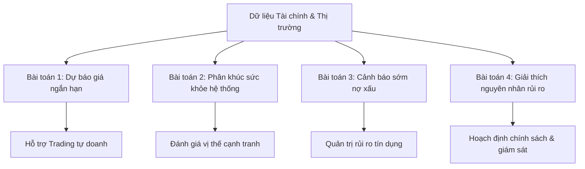

# Hướng Dẫn Kể Chuyện Bằng Biểu Đồ (Data Storytelling Guide) — DWH & ML Project

> **Dự án**: Kho dữ liệu & Phân tích Học máy Hệ thống Ngân hàng Việt Nam  
> **Áp dụng**: Thiết kế tiêu đề, cấu trúc và thuyết minh biểu đồ trên Looker Studio Dashboard  
> **Nguyên lý nền tảng**: Quy chuẩn Kể chuyện bằng dữ liệu (Cole Nussbaumer Knaflic) & Các chỉ số tài chính chuẩn ERP (NetSuite KPIs)

---

## 1. Bốn (4) Bài Toán Kinh Doanh Trọng Tâm Của Dự Án
Để kể một câu chuyện chuyên nghiệp, trước hết chúng ta phải xác định rõ 4 bài toán lớn mà dự án này giải quyết cho doanh nghiệp/hệ thống tài chính:

1.  **Bài toán 1: Dự báo xu hướng giá và tối ưu hóa thời điểm giao dịch (BID Stock Forecasting)**
    *   *Mục tiêu*: Sử dụng mạng LSTM kết hợp dòng tiền ròng của Khối ngoại và Tự doanh để dự báo giá đóng cửa BIDV trong 5 ngày tới ($T+1$ đến $T+5$).
2.  **Bài toán 2: Phân nhóm định hình cấu trúc cạnh tranh (Bank CAMELS Clustering)**
    *   *Mục tiêu*: Áp dụng thuật toán K-Means kết hợp giảm chiều dữ liệu PCA để phân hóa 46 ngân hàng Việt Nam thành các nhóm có cùng "chân dung tài chính" nhằm đánh giá đối thủ cùng phân khúc.
3.  **Bài toán 3: Radar cảnh báo sớm nguy cơ nợ xấu (Early Risk Warning)**
    *   *Mục tiêu*: Xây dựng mô hình Random Forest phân loại các ngân hàng có rủi ro nợ xấu vượt ngưỡng an toàn quy định (NPL $\ge$ 3%) để kích hoạt các biện pháp phòng ngừa rủi ro.
4.  **Bài toán 4: Giải thích các động cơ cốt lõi gây suy yếu hệ thống (Explainable Risk Drivers)**
    *   *Mục tiêu*: Trích xuất độ quan trọng đặc trưng (Feature Importance) của mô hình học máy để chỉ ra chính xác chỉ số CAMELS nào đang tạo áp lực lớn nhất lên sự suy giảm chất lượng tài sản.

---

## 2. Ứng Dụng 6 Nội Dung Thiết Yếu Trong Kể Chuyện Bằng Biểu Đồ

### 2.1. Thấu hiểu bối cảnh (Understand the Context)
*   **Người xem là ai?**:
    *   *Persona A (Risk Manager)*: Quan tâm đến rủi ro nợ xấu, thanh khoản, sự suy yếu của hệ thống.
    *   *Persona B (Financial Analyst/Investor)*: Quan tâm đến cơ hội sinh lời, định giá, xu hướng cổ phiếu.
*   **Hành động mong muốn**:
    *   Giám đốc rủi ro: Kịp thời siết chặt tiêu chuẩn tín dụng đối với nhóm ngân hàng rủi ro cao.
    *   Nhà đầu tư: Quyết định giải ngân/cắt lỗ cổ phiếu dựa trên xu hướng dòng tiền lớn và dự báo giá.

### 2.2. Lựa chọn hình ảnh trực quan phù hợp (Choose the Right Visual Display)
*   **Chuỗi thời gian giá cổ phiếu**: Sử dụng **Biểu đồ đường (Line Chart)** biểu diễn tính liên tục của xu hướng.
*   **Dòng tiền ròng khối ngoại/tự doanh**: Sử dụng **Biểu đồ cột (Bar Chart)** có trục gốc 0 để thấy rõ lực mua (dương) và bán (âm).
*   **Phân cụm ngân hàng**: Sử dụng **Biểu đồ phân tán (Scatter Plot)** trên tọa độ PC1-PC2 để thấy khoảng cách và sự cô lập của nhóm.
*   **Chân dung tài chính CAMELS**: Sử dụng **Biểu đồ mạng nhện (Radar Chart)** để so sánh đa chiều (nhiều chỉ số cùng lúc).

### 2.3. Loại bỏ yếu tố gây nhiễu (Eliminate Clutter)
*   **Hành động thực tế**:
    *   Bỏ bớt các đường lưới (gridlines) quá đậm, chỉ giữ lại nét đứt mờ.
    *   Tránh sử dụng biểu đồ 3D gây nhiễu thị giác.
    *   Rút ngắn các nhãn ngày trên trục hoành (ví dụ: hiển thị định dạng `Tháng-Năm` thay vì ngày giờ chi tiết).
    *   Sắp xếp dữ liệu bảng theo thứ tự rủi ro giảm dần để giảm tải thông tin cần xử lý.

### 2.4. Hướng dẫn sự chú ý vào điều mong muốn (Focus Attention)
*   **Sử dụng màu sắc tương phản (Highlighting)**:
    *   Sử dụng **Màu Đỏ nổi bật** duy nhất cho các ngân hàng có rủi ro cao (NPL $\ge$ 3%), các dòng dữ liệu khác dùng màu xám hoặc xanh nhẹ.
    *   Sử dụng đường **đứt nét màu cam** để biểu thị giá dự báo tương lai, phân biệt rõ với nét liền màu xanh của lịch sử giá.
    *   Vẽ đường **ngưỡng đỏ cắt ngang mức 3% NPL** trên biểu đồ xu hướng để mắt người xem tự động đối chiếu điểm vượt ngưỡng.

### 2.5. Tư duy như một nhà thiết kế (Think Like a Designer)
*   **Sự nhất quán (Consistency)**: Thống nhất màu sắc đại diện xuyên suốt các trang (ví dụ: Cluster 1 luôn là màu đỏ ở cả biểu đồ phân tán lẫn radar).
*   **Bố cục (Alignment)**: Sắp xếp các chỉ số quan trọng (Scorecards) lên góc trên cùng bên trái - nơi mắt người đọc bắt đầu quét đầu tiên.
*   **Rõ ràng (Clarity)**: Đặt tên trục đầy đủ đơn vị đo lường (ví dụ: "Nghìn VND/Cổ phiếu", "Phần trăm %").

### 2.6. Kể một câu chuyện (Tell a Story)
*   Không chỉ báo cáo con số tĩnh. Hãy dẫn dắt người xem đi từ:
    *   *Bối cảnh*: Thị trường đang biến động thế nào?
    *   *Biến cố*: Ngân hàng nào đang xuất hiện rủi ro nợ xấu hoặc giá cổ phiếu đang giảm mạnh?
    *   *Nguyên nhân*: Các chỉ số trích lập dự phòng (LLP) hay chi phí hoạt động (CIR) đã đẩy rủi ro lên thế nào?
    *   *Hành động*: Đề xuất hành động ứng phó phù hợp.

---

## 3. Bản Thiết Kế Câu Chuyện & Tên Biểu Đồ Thực Tế

Thay vì sử dụng các tiêu đề kỹ thuật vô hồn (ví dụ: "Biểu đồ giá đóng cửa", "Bản đồ phân cụm"), chúng ta áp dụng **tiêu đề có tính dẫn dắt và kể chuyện nghiệp vụ**:

### Trang 1: Biến Động Thị Trường & Dự Báo Giá Cổ Phiếu BID

| Biểu đồ gốc | Tiêu đề kể chuyện nghiệp vụ (Proposed Title) | Câu chuyện nghiệp vụ cần dẫn dắt |
| :--- | :--- | :--- |
| **MM-01: Line Chart** | **Dự Báo Giá BID 5 Phiên Tới: Xu Hướng Điều Chỉnh Nhẹ Trước Khi Phục Hồi Lên Ngưỡng 41.93** | Chỉ ra rằng giá đóng cửa thực tế phiên cuối (41.70) có thể giảm nhẹ về 41.57 ở T+1 nhưng sau đó sẽ tăng dần lên 41.93 ở T+5, hỗ trợ đưa ra quyết định nắm giữ thay vì bán tháo. |
| **MM-02: Bar Chart** | **Lực Mua Ròng Của Khối Ngoại Tạo Bệ Đỡ Cho BIDV Tại Vùng Giá 41.00 - 42.00** | Chứng minh dòng tiền ngoại liên tục mua ròng ở các phiên giá điều chỉnh nhẹ, cho thấy định giá hấp dẫn trong trung hạn. |
| **MM-03: Bar Chart** | **Dòng Tiền Tự Doanh Chốt Lời Ngắn Hạn Gây Áp Lực Lên Đà Tăng Giá** | Chỉ ra rằng đà tăng bị kìm hãm chủ yếu do khối tự doanh trong nước liên tục bán ròng chốt lời khi giá đạt vùng đỉnh ngắn hạn. |

---

### Trang 2: Định Hình Vị Thế & Phân Khúc Hệ Thống Ngân Hàng

| Biểu đồ gốc | Tiêu đề kể chuyện nghiệp vụ (Proposed Title) | Câu chuyện nghiệp vụ cần dẫn dắt |
| :--- | :--- | :--- |
| **BP-01: Scatter Plot** | **Bản Đồ Vị Thế Hệ Thống: Đông Á Bank (DAB) Bị Cô Lập Hoàn Toàn Khỏi Nhóm Hoạt Động Bình Thường** | Thể hiện trực quan khoảng cách xa xôi của DAB (Cluster 1) so với 44 ngân hàng khác (Cluster 0), minh chứng cho sự bất thường đặc biệt trong cấu trúc tài chính của ngân hàng bị kiểm soát đặc biệt. |
| **BP-02: Radar Chart** | **Chân Dung CAMELS Của Sự Dị Thường: Cluster 1 Hụt Hơi Về Khả Năng Sinh Lời Và An Toàn Vốn** | Đường đa giác của Cluster 1 (DAB) bị co hẹp nghiêm trọng ở các trục ROA, ROE, NIM và bị kéo dài bất thường ở trục NPL Ratio so với đa giác cân đối của Cluster 0. |
| **BP-04: Pie/Bar Chart** | **Các Ngân Hàng Quốc Doanh (SOCB) Duy Trì Vị Thế Trụ Cột Vững Chắc Tại Cluster 0** | Chỉ ra cơ cấu an toàn của Cluster 0 khi quy tụ toàn bộ nhóm Big Four quốc doanh và các ngân hàng lớn có vốn FDI. |

---

### Trang 3: Radar Cảnh Báo Sớm Rủi Ro Tín Dụng (NPL Classification)

| Biểu đồ gốc | Tiêu đề kể chuyện nghiệp vụ (Proposed Title) | Câu chuyện nghiệp vụ cần dẫn dắt |
| :--- | :--- | :--- |
| **RM-01: Data Table** | **Danh Sách Giám Sát Đỏ: Cảnh Báo Các Ngân Hàng Tiệm Cận Ngưỡng Nợ Xấu 3%** | Bảng sử dụng màu đỏ nổi bật để nhấn mạnh PVB, BVB, PGB có nguy cơ hoặc thực tế vượt ngưỡng 3% NPL trong lịch sử, yêu cầu giám sát đặc biệt. |
| **RM-02: Line Chart** | **Lịch Sử Vượt Ngưỡng Nợ Xấu 3% Của Các Ngân Hàng PVB, BVB và PGB** | Trực quan hóa đường xu hướng thực tế của các ngân hàng bị mô hình học máy gắn nhãn rủi ro cao, minh chứng mô hình đã phát hiện sớm chính xác. |
| **RM-03: Bar Chart** | **Tỷ Lệ Dự Phòng Rủi Ro (LLP) Là Chỉ Số Cảnh Báo Sớm Hàng Đầu Về Nguy Cơ Nợ Xấu** | Giải thích cơ chế học của AI: Mô hình dựa vào tỷ lệ trích lập dự phòng (`llp_ratio`) để phán đoán rủi ro trước tiên, phù hợp với nghiệp vụ quản trị của ngân hàng khi dự phòng luôn tăng trước khi nợ xấu lộ diện. |

---

## 4. Tích Hợp Chỉ Số Tài Chính Chuẩn ERP (NetSuite Metrics Application)
Để nâng tầm chuyên nghiệp, chúng ta tích hợp và ánh xạ các chỉ số tài chính của bài viết NetSuite vào mô hình phân tích CAMELS của ngân hàng:

1.  **Return on Assets (ROA) & Return on Equity (ROE)** *(NetSuite Metrics 23 & 5)*:
    *   *Áp dụng*: Đây là lõi khía cạnh **E** (Earnings Ability) trong CAMELS. Giúp phân biệt ngân hàng sử dụng tài sản hiệu quả (Cluster 0) với ngân hàng bị đọng vốn, lỗ lũy kế (Cluster 1).
2.  **Cost-to-Income Ratio (CIR) - Tương đương SG&A Ratio** *(NetSuite Metric 24)*:
    *   *Áp dụng*: Đo lường hiệu quả quản trị chi phí hoạt động. Ngân hàng có CIR quá cao (vượt 40%) sẽ có hiệu năng kém và dễ tổn thương hơn khi thị trường biến động.
3.  **Net Interest Margin (NIM) - Tương đương Gross Profit Margin** *(NetSuite Metric 1)*:
    *   *Áp dụng*: Thể hiện chênh lệch giữa thu nhập lãi thuần và chi phí vốn. Đây là chỉ số sống còn của ngân hàng thương mại, phản ánh năng lực định giá cho vay và huy động vốn.
4.  **Liquid Assets / Total Deposits (LTD) - Tương đương Current/Quick Ratio** *(NetSuite Metrics 5 & 7)*:
    *   *Áp dụng*: Khía cạnh **L** (Liquidity) đánh giá khả năng thanh khoản ngắn hạn chống đỡ các đợt rút tiền hàng loạt (bank-run).
