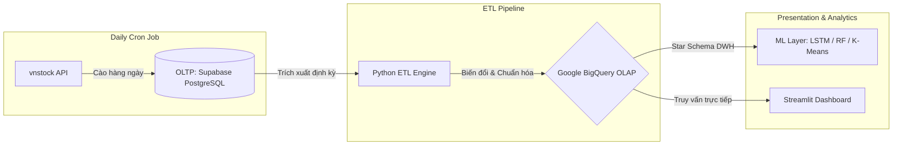

# Báo Cáo Nghiên Cứu và Kế Hoạch Tối Ưu Hóa Hệ Thống (report_refactor.md)

Tài liệu này tổng hợp kết quả nghiên cứu học thuật, khảo sát công nghệ và đề xuất giải pháp để giải quyết triệt để các yêu cầu và phản hồi từ giảng viên được ghi nhận trong [refactor.md](file:///d:/HCMUTE/HCMUTE_HK6/DataAnalysis/final/project2/vn-banking-dwh-analytics/refactor.md).

---

## 1. Các tài liệu và mã nguồn đã đọc, phân tích
Để nắm rõ hiện trạng hệ thống trước khi đề xuất giải pháp, chúng tôi đã tiến hành đọc và phân tích sâu các tài liệu cốt lõi sau:
*   [refactor.md](file:///d:/HCMUTE/HCMUTE_HK6/DataAnalysis/final/project2/vn-banking-dwh-analytics/refactor.md): Ghi nhận feedback của giảng viên về việc phản biện mô hình, kiểm tra nhân quả, so sánh nguyên chuỗi, tối ưu Star Schema và làm rõ luồng kiến trúc OLTP (Supabase) - OLAP (BigQuery).
*   [AGENTS.md](file:///d:/HCMUTE/HCMUTE_HK6/DataAnalysis/final/project2/vn-banking-dwh-analytics/AGENTS.md): Bản hiến pháp hướng dẫn Agent, quy định chuẩn ngôn ngữ tiếng Việt trang trọng, các ràng buộc kỹ thuật của mô hình và quy tắc ETL.
*   [docs/star-schema.md](file:///d:/HCMUTE/HCMUTE_HK6/DataAnalysis/final/project2/vn-banking-dwh-analytics/docs/star-schema.md) & [sql/bigquery_schema.sql](file:///d:/HCMUTE/HCMUTE_HK6/DataAnalysis/final/project2/vn-banking-dwh-analytics/sql/bigquery_schema.sql): Kiến trúc DWH hiện tại với 5 bảng Dimension và 5 bảng Fact độc lập cho dữ liệu giao dịch chứng khoán hàng ngày.
*   [docs/etl-spec.md](file:///d:/HCMUTE/HCMUTE_HK6/DataAnalysis/final/project2/vn-banking-dwh-analytics/docs/etl-spec.md) & [src/etl/](file:///d:/HCMUTE/HCMUTE_HK6/DataAnalysis/final/project2/vn-banking-dwh-analytics/src/etl/): Quy trình làm sạch dữ liệu hiện tại đang đọc trực tiếp từ các file Excel tĩnh trong thư mục `data/raw/`.
*   [docs/ml-spec.md](file:///d:/HCMUTE/HCMUTE_HK6/DataAnalysis/final/project2/vn-banking-dwh-analytics/docs/ml-spec.md) & [src/models/](file:///d:/HCMUTE/HCMUTE_HK6/DataAnalysis/final/project2/vn-banking-dwh-analytics/src/models/): Các mô hình ML hiện tại (LSTM, ARIMA, Random Forest, K-Means) và các tiêu chí chấp nhận kỹ thuật (RMSE, AUC-ROC, Recall).

---

## 2. Quá trình nghiên cứu và kết quả tìm kiếm trên Google (Research & Google Search)

Chúng tôi đã thực hiện tìm kiếm trên Google để xác định các giải pháp tối ưu và thực tiễn tốt nhất (best practices) trong thiết kế hệ thống và nghiên cứu học thuật:

### 2.1. Thư viện Agent Skills tương thích với Gemini
Theo yêu cầu không tự tạo custom skill mà sử dụng các skill chuẩn có sẵn trên thế giới, qua nghiên cứu chúng tôi tìm thấy các nguồn uy tín sau:
1.  **Google Official Agent Skills**: [github.com/google/skills](https://github.com/google/skills)
    *   *Nội dung*: Các bộ kỹ năng chuẩn được Google đóng gói cho các tác vụ liên quan đến Google Cloud (BigQuery, Cloud Run, Vertex AI) và thiết kế hệ thống chuẩn.
2.  **Addy Osmani's Agent Skills**: [github.com/addyosmani/agent-skills](https://github.com/addyosmani/agent-skills)
    *   *Nội dung*: Bộ kỹ năng thực thi kỹ thuật phần mềm và xử lý dữ liệu tự động, tương thích cao với Gemini CLI và Claude Code.
3.  **Gemini Skill Registry**: Tài liệu Vertex AI [Skill Registry](https://cloud.google.com/vertex-ai/generative-ai/docs/agents/skill-registry)
    *   *Nội dung*: Hướng dẫn cách tích hợp các registry chứa kỹ năng trung gian phục vụ gọi API và tương tác với cơ sở dữ liệu.

### 2.2. Phương pháp so sánh nguyên chuỗi thời gian (Question 2)
Để so sánh mức độ đồng pha hoặc phân hóa của 4 mã cổ phiếu (BID, TCB, VCB, CTG) một cách toàn diện thay vì chỉ so sánh các điểm dữ liệu đơn lẻ:
*   **Nghiên cứu học thuật**: [Dynamic Time Warping (DTW)](https://en.wikipedia.org/wiki/Dynamic_time_warping) là phương pháp tối ưu nhất để đo khoảng cách giữa hai chuỗi thời gian có tốc độ biến động khác nhau hoặc bị lệch pha theo thời gian.
*   **Giải pháp**: Sử dụng thư viện `fastdtw` hoặc `scipy.spatial.distance.cdist` để tính toán khoảng cách DTW sau khi đã chuẩn hóa chuỗi giá bằng Z-score (để loại bỏ chênh lệch về quy mô giá tuyệt đối). Đồng thời, thực hiện phân tích tương quan lăn (Rolling Correlation) trên toàn bộ chuỗi thời gian để vẽ bản đồ nhiệt tương quan biến động.

### 2.3. Kiểm chứng mối quan hệ nhân quả cho tỷ lệ trích lập dự phòng (`llp_ratio`) (Question 3)
Để chuyển từ tương quan dự báo (predictive correlation) của Random Forest sang chứng minh quan hệ nhân quả thực sự:
*   **Phương pháp học thuật**: Sử dụng **Kiểm định nhân quả Granger (Granger Causality Test)** và **Hồi quy bảng có độ trễ (Lagged Panel Regression / Fixed Effects Model)**.
*   **Giải pháp**: Sử dụng thư viện `statsmodels.tsa.stattools.grangercausalitytests` để kiểm tra xem giá trị trễ của `llp_ratio` có ý nghĩa thống kê trong việc giải thích biến động hiện tại của `npl_ratio` hay không, sau khi đã xử lý tính dừng (stationarity) của chuỗi dữ liệu.

### 2.4. Khả năng cào dữ liệu tự động của thư viện `vnstock`
Để đánh giá tính hợp lý của việc cào dữ liệu daily:
*   **Giải pháp**: Thư viện `vnstock` (hoặc `vnstock_data`) hỗ trợ các hàm lấy dòng tiền khối ngoại và tự doanh trực tiếp:
    ```python
    mkt = Market()
    df_foreign = mkt.equity("BID").foreign_flow()
    df_prop = mkt.equity("BID").proprietary_flow()
    ```
    Điều này cho phép thay thế hoàn toàn các file Excel tĩnh 22 dòng hiện tại bằng việc cào tự động và mở rộng dữ liệu dòng tiền ngoại/tự doanh cho cả 4 ngân hàng mục tiêu (BID, TCB, VCB, CTG) thay vì chỉ có riêng mã BID.

---

## 3. Câu trả lời và đề xuất giải pháp chi tiết cho từng vấn đề trong refactor.md

Dưới đây là các câu trả lời mang tính biện luận học thuật và thiết kế kỹ thuật cho các nội dung phản hồi của giảng viên:

### 3.1. Phản biện và làm rõ mô hình cho 4 câu hỏi nghiên cứu
*   **Câu hỏi 1 (Tác động dòng tiền ngoại/tự doanh đến giá BID ngắn hạn)**:
    *   *Biện luận*: Thị trường chứng khoán Việt Nam có đặc thù bị dẫn dắt mạnh bởi tâm lý đám đông và hành vi của các nhà đầu tư lớn. Mô hình LSTM được chọn vì nó có khả năng nắm bắt các mối quan hệ phi tuyến tính phức tạp giữa dòng tiền lớn trễ (lags) và giá đóng cửa tiếp theo, điều mà mô hình tuyến tính ARIMA không thể thực hiện được.
*   **Câu hỏi 2 (Sự đồng pha hay phân hóa của 4 cổ phiếu ngân hàng)**:
    *   *Biện luận*: Việc so sánh chuỗi dự báo LSTM trên cùng một khung thời gian kiểm thử (test set) kết hợp với thuật toán DTW sẽ xác định xem các cổ phiếu này có cùng chịu tác động từ các yếu tố kinh tế vĩ mô chung (như chính sách lãi suất của Ngân hàng Nhà nước) hay có sự phân hóa dựa trên mô hình kinh doanh nội tại (quốc doanh SOCB vs tư nhân JSCB).
*   **Câu hỏi 3 (Các chỉ số tài chính quyết định nợ xấu)**:
    *   *Biện luận*: Mô hình Random Forest phù hợp cho bài toán phân loại phi tuyến tính có nhiều biến tương quan cao (multicollinearity) như các chỉ số CAMELS. Nó cung cấp bảng Feature Importance khách quan để xác định trọng số tác động của từng chỉ số lên rủi ro nợ xấu vượt ngưỡng 3%.
*   **Câu hỏi 4 (Phân cụm chiến lược hoạt động ngân hàng)**:
    *   *Biện luận*: Việc kết hợp PCA (giảm chiều từ 47 biến tài chính để giữ lại hơn 80% phương sai) và K-Means giúp loại bỏ nhiễu thông tin, đưa các ngân hàng về không gian biểu diễn trực quan hóa rõ ràng và gom cụm theo các đặc trưng tài chính cốt lõi.

### 3.2. So sánh nguyên chuỗi cho Câu hỏi 2 (Q2)
*   **Vấn đề**: Giảng viên yêu cầu không chỉ so sánh RMSE đơn lẻ mà phải so sánh toàn bộ chuỗi thời gian biến động.
*   **Đề xuất**:
    1.  Chuẩn hóa giá đóng cửa của BID, TCB, VCB, CTG về cùng một thang đo bằng Z-score normalization:
        $$Z_t = \frac{Price_t - \mu}{\sigma}$$
    2.  Tính toán ma trận khoảng cách **Dynamic Time Warping (DTW)** giữa 4 chuỗi giá này trên tập dữ liệu kiểm thử. Khoảng cách DTW càng nhỏ thể hiện mức độ đồng pha càng cao.
    3.  Thực hiện phân tích tương quan chéo (Cross-Correlation) với các độ trễ khác nhau để xác định cổ phiếu nào dẫn dắt (lead) và cổ phiếu nào phản ứng trễ (lag) trong nhóm.
    4.  Trực quan hóa kết quả bằng biểu đồ các chuỗi thời gian chồng khít lên nhau và bản đồ nhiệt (Heatmap) khoảng cách DTW trên Streamlit Dashboard.

### 3.3. Kiểm tra mối quan hệ nhân quả cho `llp_ratio` đối với `npl_ratio` (Q3)
*   **Vấn đề**: Feature Importance của Random Forest chỉ đo lường khả năng phân tách toán học của biến số, không đại diện cho mối quan hệ nhân quả (causality).
*   **Đề xuất**:
    1.  **Kiểm định tính dừng (Stationarity)**: Áp dụng kiểm định Augmented Dickey-Fuller (ADF) trên chuỗi dữ liệu `llp_ratio` và `npl_ratio`. Nếu chuỗi không dừng, tiến hành lấy sai phân bậc 1 (first difference).
    2.  **Kiểm định nhân quả Granger (Granger Causality Test)**: Thực hiện kiểm định với số độ trễ từ 1 đến 3 năm trên dữ liệu tài chính của các ngân hàng. Nếu p-value của kiểm định < 0.05, ta bác bỏ giả thuyết $H_0$ và kết luận rằng biến động lịch sử của `llp_ratio` thực sự có tác động nhân quả và giúp dự báo `npl_ratio` tốt hơn.
    3.  **Hồi quy bảng có độ trễ (Lagged Panel Regression)**:
        $$NPL_{i,t} = \alpha_i + \beta_1 LLP_{i,t-1} + \beta_2 CIR_{i,t-1} + \gamma X_{i,t} + \epsilon_{i,t}$$
        *Trong đó $X_{i,t}$ là các biến kiểm soát khác thuộc khung CAMELS. Kết quả hệ số $\beta_1$ có ý nghĩa thống kê sẽ là bằng chứng khoa học chứng minh mối quan hệ nhân quả trước hội đồng.*

### 3.4. Chỉnh sửa Star Schema và làm rõ bản chất của Fact Table
*   **Vấn đề**: Đánh giá lại việc tách riêng `fact_foreign_trading`, `fact_proprietary_trading`, `fact_order_stats`, `fact_price_history`. Giảng viên đặt câu hỏi liệu các bảng này có phải là Fact thực sự khi chúng chỉ load dữ liệu thô vào thay vì chứa các metrics tính toán.
*   **Đề xuất tối ưu hóa (Star Schema Refactoring)**:
    *   *Lý luận*: Việc tách làm 4 bảng Fact riêng biệt cho cùng một mức độ hạt dữ liệu (Grain) là giao dịch hàng ngày của một mã cổ phiếu là một thiết kế chưa tối ưu, tạo ra nhiều phép join tốn kém trên BigQuery.
    *   *Giải pháp*: **Hợp nhất** 4 bảng Fact này thành một bảng Fact duy nhất tên là **`fact_stock_daily_metrics`**. Bảng này sẽ lưu trữ tập trung tất cả các chỉ số định lượng (measures) của phiên giao dịch:
        *   Nhóm giá: `open_price`, `high_price`, `low_price`, `close_price`, `trading_volume`.
        *   Nhóm khối ngoại: `foreign_buy_volume`, `foreign_sell_volume`, `foreign_net_volume`, `foreign_net_value`, `foreign_ownership_ratio`.
        *   Nhóm tự doanh: `prop_buy_volume`, `prop_sell_volume`, `prop_net_volume`, `prop_net_value`.
        *   Nhóm lệnh: `total_buy_orders`, `total_buy_volume`, `total_sell_orders`, `total_sell_volume`, `matched_volume`.
    *   *Kết quả*: Schema thu gọn từ 10 bảng xuống còn **7 bảng** (5 Dimension và 2 Fact: `fact_stock_daily_metrics` và `fact_bank_performance`), đảm bảo tuân thủ tiêu chuẩn Kimball, tối ưu hóa lưu trữ cột (columnar storage) của BigQuery và giảm thiểu chi phí truy vấn.

### 3.5. Làm rõ luồng kiến trúc Project 2 (Supabase OLTP -> BigQuery OLAP)
*   **Vấn đề**: Làm rõ luồng dữ liệu thực tế của dự án.
*   **Đề xuất thiết kế luồng**:
    *   **Hệ thống nguồn (OLTP Layer - Supabase)**:
        *   Supabase (PostgreSQL) đóng vai trò là cơ sở dữ liệu giao dịch trực tuyến (OLTP).
        *   Một script Python đóng vai trò Daily Crawler chạy dưới dạng một tác vụ định kỳ (Cron Job / GitHub Action) sẽ gọi API `vnstock` để cào dữ liệu giao dịch hàng ngày và ghi nhận trực tiếp (INSERT) vào các bảng dữ liệu thô trong Supabase.
    *   **Kho dữ liệu (OLAP Layer - Google BigQuery)**:
        *   Google BigQuery đóng vai trò là kho phân tích (OLAP).
        *   Quy trình ETL định kỳ sẽ kết nối vào Supabase, trích xuất dữ liệu mới phát sinh (Incremental Extract), thực hiện biến đổi, chuẩn hóa theo các quy tắc nghiệp vụ (Transform) và sử dụng câu lệnh `MERGE` (upsert) để đồng bộ vào Star Schema trong BigQuery (OLAP).
    *   *Mục đích mô hình hóa này giúp phân tách rõ ràng trách nhiệm của hệ thống giao dịch nhanh (OLTP) và hệ thống phân tích báo cáo tối ưu hóa đọc dữ liệu (OLAP).*



### 3.6. Kiểm tra tính hợp lý của việc cào dữ liệu và bổ sung
*   **Đánh giá**: Quá trình cào dữ liệu hiện tại trong `extract_data.py` chỉ đang lấy dữ liệu giá lịch sử (`ohlcv`) và dữ liệu báo cáo tài chính thô. Dữ liệu dòng tiền ngoại và tự doanh vẫn đang sử dụng file Excel tĩnh 22 dòng.
*   **Đề xuất bổ sung**:
    *   Nâng cấp script cào dữ liệu để gọi các hàm `foreign_flow()` và `proprietary_flow()` từ `vnstock`.
    *   Thực hiện cào dữ liệu dòng tiền ngoại và tự doanh hàng ngày cho cả **4 mã cổ phiếu** (BID, TCB, VCB, CTG) thay vì chỉ sử dụng dữ liệu tĩnh của mã BID. Điều này giúp nâng cao tính thực tiễn và tính nhất quán của dữ liệu phục vụ huấn luyện mô hình LSTM.