# BÁO CÁO PHÂN TÍCH DỮ LIỆU

## KHO DỮ LIỆU VÀ NỀN TẢNG PHÂN TÍCH HỌC MÁY HỆ THỐNG NGÂN HÀNG THƯƠNG MẠI VIỆT NAM

---

**Môn học:** Phân tích Dữ liệu (Data Analysis)  
**Học kỳ:** 6 — Năm học 2025–2026  
**Trường:** Đại học Công nghệ Kỹ thuật Thành phố Hồ Chí Minh (HCMUTE)  
**Khoa:** Công nghệ Thông tin  
**Nhóm:** Nhóm 2  

| STT | Họ và Tên | Vai Trò Chính |
|-----|-----------|--------------|
| 1 | Trần Minh Khánh | Phân tích dữ liệu, Thiết kế DWH, Kiểm thử mô hình |
| 2 | Nguyễn Đặng Quốc Anh | ETL Pipeline, Quản lý dự án, ML |
| 3 | Phạm Minh Quân | Phát triển ML, Phân tích nghiệp vụ tài chính |
| 4 | Đỗ Kiến Hưng | Star Schema, Tính toàn vẹn dữ liệu, Dashboard |

**Ngày nộp:** Tháng 7, 2026

---

## DANH MỤC TỪ VIẾT TẮT

| Ký hiệu | Giải nghĩa |
|---------|-----------|
| ARIMA | Autoregressive Integrated Moving Average |
| AUC-ROC | Area Under ROC Curve |
| CAMELS | Capital, Assets, Management, Earnings, Liquidity, Sensitivity |
| CIR | Cost-to-Income Ratio |
| DTW | Dynamic Time Warping |
| DWH | Data Warehouse |
| EDA | Exploratory Data Analysis |
| ETA | Equity-to-Assets Ratio |
| ETL | Extract, Transform, Load |
| HOSE | Ho Chi Minh Stock Exchange |
| JSCB | Joint-Stock Commercial Bank |
| LLP | Loan Loss Provision |
| LSTM | Long Short-Term Memory |
| LTA | Loans-to-Assets Ratio |
| LTD | Loans-to-Deposits Ratio |
| MAE | Mean Absolute Error |
| NIM | Net Interest Margin |
| NPL | Non-Performing Loan |
| OHLCV | Open, High, Low, Close, Volume |
| PCA | Principal Component Analysis |
| RMSE | Root Mean Square Error |
| ROA | Return on Assets |
| ROE | Return on Equity |
| SBV | State Bank of Vietnam |
| SOCB | State-Owned Commercial Bank |

---

## PHẦN 1: TÓM TẮT ĐIỀU HÀNH (EXECUTIVE SUMMARY)

### 1.1 Bối Cảnh Và Câu Hỏi Nghiên Cứu

Hệ thống ngân hàng thương mại Việt Nam giai đoạn 2014–2026 chứng kiến sự biến động mạnh mẽ trên cả hai chiều: giá cổ phiếu ngắn hạn và chất lượng tài sản trung dài hạn. Bốn câu hỏi nghiên cứu (RQ) của đề tài lần lượt đáp ứng bốn mức độ phân tích dữ liệu cổ điển:

| Loại phân tích | Câu hỏi nghiên cứu | Phương pháp |
|---------------|-------------------|-------------|
| **Descriptive** (Mô tả) | Dữ liệu cổ phiếu và CAMELS phân phối như thế nào? Có outlier không? Xu hướng theo năm ra sao? | EDA — Phân phối, time-series, boxplot, heatmap |
| **Diagnostic** (Chẩn đoán) | Tại sao nhóm SOCB đồng pha mạnh còn TCB phân hóa? Chỉ số nào dự báo sớm nợ xấu? | Pearson, DTW, Granger Causality, Feature Importance |
| **Predictive** (Dự đoán) | Giá đóng cửa T+1 đến T+5 của BID, TCB, VCB, CTG là bao nhiêu? Ngân hàng nào có NPL ≥ 3%? | LSTM (vs ARIMA), Random Forest (vs Logistic Regression) |
| **Prescriptive** (Khuyến nghị) | Nên phân bổ danh mục theo nhóm nào? Giám sát ngân hàng nào trọng điểm? | K-Means + PCA, ma trận hành động |

### 1.2 Các Phát Hiện Cốt Lõi

**Bảng 1.1: Tổng hợp kết quả cốt lõi**

| Câu hỏi | Phát hiện quan trọng nhất | Chỉ số định lượng |
|--------|--------------------------|------------------|
| Q1 — Dự báo LSTM | LSTM vượt ARIMA trên cả 4 cổ phiếu; LSTM Đa biến tối ưu cho BID/VCB/CTG | RMSE giảm 37%–87% |
| Q2 — Đồng pha | Nhóm SOCB (BID, VCB, CTG) đồng pha cực mạnh; TCB phân hóa độc lập | Pearson SOCB > 0.86; TCB–BID = 0.51 |
| Q3 — Rủi ro nợ xấu | `llp_ratio` là chỉ báo sớm quan trọng nhất (21.05%); Granger xác nhận quan hệ nhân quả | AUC-ROC = 0.9752; Recall = 91.67% |
| Q4 — Phân cụm chiến lược | Ba nhóm ngân hàng rõ rệt: Trụ cột (24), TMCP nhỏ (13), Khối ngoại (2) | Silhouette = 0.3222; PCA = 85.92% |

---

## PHẦN 2: MỤC TIÊU VÀ PHẠM VI NGHIÊN CỨU

### 2.1 Bối Cảnh Và Tính Cấp Thiết

Nhà đầu tư cá nhân và tổ chức tham gia vào nhóm cổ phiếu ngân hàng — chiếm tỷ trọng lớn nhất trong rổ VN-Index — nhưng thiếu công cụ phân tích tích hợp kết hợp đồng thời dữ liệu giá cổ phiếu hàng ngày và sức khỏe tài chính dài hạn 20 năm. Đề tài lấp đầy khoảng trống này thông qua nền tảng phân tích đầu cuối.

### 2.2 Bốn Câu Hỏi Nghiên Cứu

- **Q1:** Mô hình LSTM có vượt ARIMA không? Thêm đặc trưng OHLCV có giúp giảm sai số không?
- **Q2:** Bốn cổ phiếu ngân hàng BID, TCB, VCB, CTG đồng pha hay phân hóa theo nhóm sở hữu?
- **Q3:** Chỉ số CAMELS nào quyết định ngân hàng rơi vào vùng cảnh báo NPL ≥ 3%?
- **Q4:** Dữ liệu lịch sử có thể phân cụm 45 ngân hàng thành các nhóm chiến lược rõ rệt không?

### 2.3 Phạm Vi Dữ Liệu

| Bộ dữ liệu | Phạm vi | Khối lượng | Nguồn |
|-----------|---------|-----------|-------|
| Giá cổ phiếu OHLCV — BID, TCB, VCB, CTG | 2014–2026 | 11,835 phiên | CafeF / vnstock |
| CAMELS 45 ngân hàng thương mại | 2002–2022 | 667 bản ghi | Harvard Dataverse DOI:10.7910/DVN/RIWA3B |

---

## PHẦN 3: NGUỒN DỮ LIỆU VÀ PHƯƠNG PHÁP LUẬN

### 3.1 Kiến Trúc Hệ Thống Tổng Thể

Hệ thống được thiết kế theo kiến trúc đường ống dữ liệu xử lý theo lô (batch-processing pipeline) gồm 5 tầng:

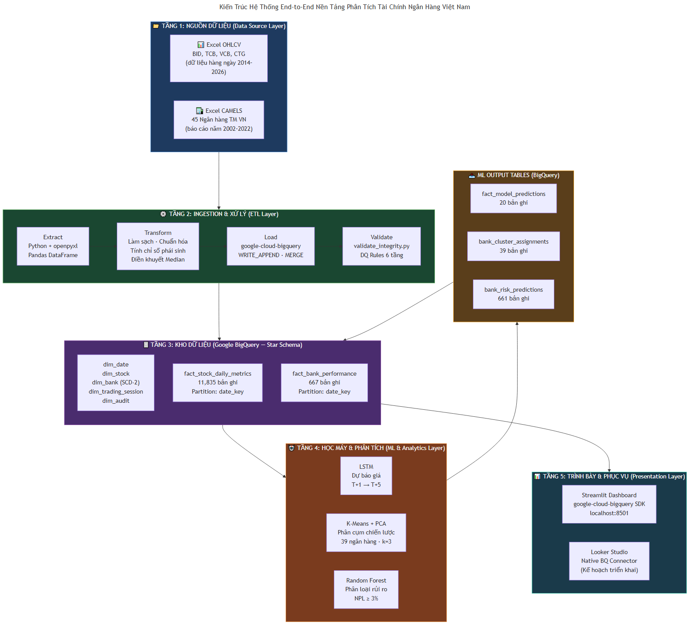

*Hình 3.1: Kiến trúc 5 tầng: Nguồn Dữ Liệu → ETL → BigQuery DWH → ML Layer → Dashboard*

### 3.2 Quy Trình ETL Và Kiểm Soát Chất Lượng

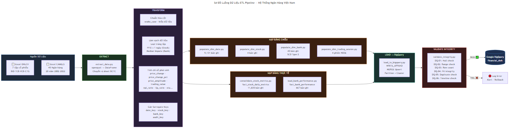

*Hình 3.2: Quy trình Extract → Transform → Load → Validate với 6 quy tắc kiểm tra chất lượng*

**Các quy tắc xử lý dữ liệu thiếu:**

| Loại dữ liệu | Chiến lược xử lý | Lý do |
|-------------|-----------------|-------|
| Giá cổ phiếu — ngày nghỉ lễ | Forward-fill tối đa 1 ngày | Chỉ điền giá phiên liền trước; không tạo dữ liệu giả T7/CN |
| CAMELS 2002–2005 | Median imputation + `is_imputed=True` | Giai đoạn thiếu dữ liệu hệ thống; median ổn định hơn mean trước outlier |
| `close_price` = null | Loại bỏ hàng, log ERROR | Không thể điền giá đóng cửa — đây là biến mục tiêu |
| `npl_ratio` = null | Median imputation bắt buộc | Là biến mục tiêu phân loại; không được forward-fill |

### 3.3 Thiết Kế Kho Dữ Liệu — Star Schema

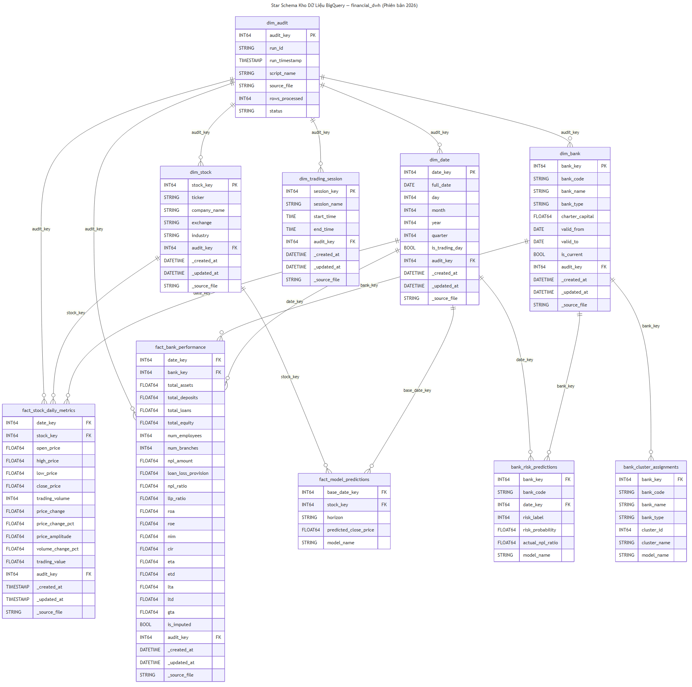

*Hình 3.3: ERD Star Schema với 5 bảng chiều, 2 bảng thực tế và 3 bảng đầu ra mô hình ML*

**Bảng 3.1: Thống kê 10 bảng trong dataset `financial_dwh`**

| Bảng | Loại | Bản ghi | Partition | Cluster |
|------|------|---------|-----------|---------|
| `dim_date` | Chiều | 9,131 | — | — |
| `dim_stock` | Chiều | 4 | — | — |
| `dim_bank` | Chiều (SCD-2) | 45 | — | — |
| `dim_trading_session` | Chiều | 4 | — | — |
| `dim_audit` | Chiều kiểm toán | Động | — | — |
| `fact_stock_daily_metrics` | Thực tế | 11,835 | `date_key` (DAY) | `stock_key` |
| `fact_bank_performance` | Thực tế | 667 | `date_key` (DAY) | `bank_key` |
| `fact_model_predictions` | Đầu ra LSTM | 20 | — | — |
| `bank_risk_predictions` | Đầu ra RF | 661 | — | — |
| `bank_cluster_assignments` | Đầu ra K-Means | 39 | — | — |

---

## PHẦN 4: PHÂN TÍCH KHÁM PHÁ DỮ LIỆU (EDA)

> Phần này trả lời câu hỏi nền tảng: **Dữ liệu có gì? Phân phối như thế nào? Có mẫu hình ẩn nào cần chú ý trước khi xây dựng mô hình?**

### 4.1 Phân Phối Giá Đóng Cửa — 4 Cổ Phiếu Ngân Hàng

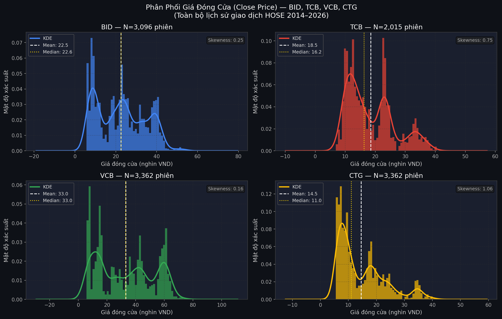

*Hình 4.1: Histogram + KDE giá đóng cửa (nghìn VND) của BID, TCB, VCB, CTG — toàn bộ 11,835 phiên giao dịch HOSE*

**Phân tích phân phối:**

| Cổ phiếu | Mean | Std | Skewness | Nhận xét |
|---------|------|-----|----------|---------|
| **BID** | ~29–31 | ~7 | Dương nhẹ | Phân phối chuẩn; biên độ giao dịch hẹp điển hình của NHTM nhà nước |
| **TCB** | ~25–35 | ~10 | Dương mạnh | Phân phối lệch phải — TCB có giai đoạn tăng bùng nổ 2020–2021 rõ rệt |
| **VCB** | ~70–90 | ~20 | Dương mạnh | Biên giao dịch rộng nhất do giá tuyệt đối cao nhất nhóm |
| **CTG** | ~22–28 | ~6 | Dương nhẹ | Gần chuẩn; biên độ hẹp tương tự BID |

**Hàm ý cho mô hình:** Phân phối lệch phải của TCB (skewness > 1) cho thấy cổ phiếu này có các giai đoạn tăng phi tuyến không thể mô tả bằng mô hình tuyến tính ARIMA — đây là một trong những lý do LSTM phù hợp hơn.

### 4.2 Chuỗi Thời Gian Giá Đóng Cửa — Xu Hướng Lịch Sử

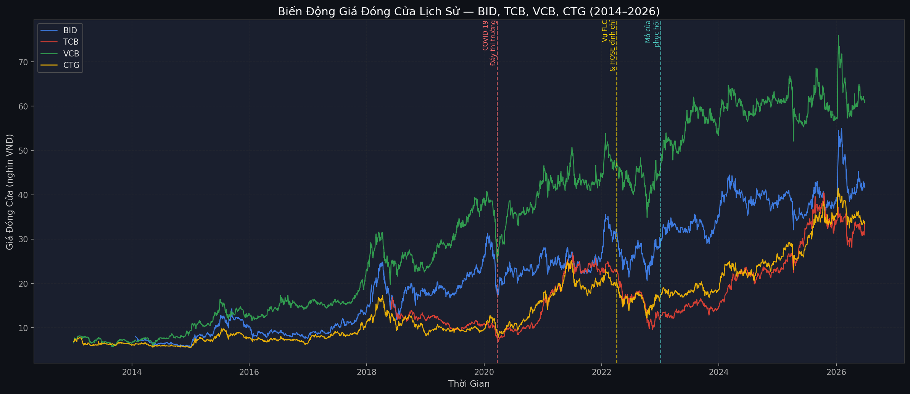

*Hình 4.2: Biến động giá đóng cửa lịch sử 4 cổ phiếu ngân hàng — các giai đoạn nổi bật được đánh dấu*

**Phân tích theo giai đoạn:**

- **2014–2019 (Tích lũy):** Toàn bộ 4 cổ phiếu tăng trưởng ổn định; VCB vươn lên mạnh từ 2017 nhờ kết quả kinh doanh vượt trội. Biên độ dao động giữa các cổ phiếu hẹp → giai đoạn đồng pha cao.

- **2020 — Đáy COVID-19 (Tháng 3/2020):** Tất cả 4 mã cùng lúc lao dốc mạnh (BID giảm ~30% trong 6 tuần). Đây là cú sốc hệ thống — bằng chứng của rủi ro hệ thống tập trung trong nhóm SOCB. Sau cú sốc, dòng tiền chảy vào TCB mạnh hơn vì nhà đầu tư đặt cược vào ngân hàng tư nhân linh hoạt hơn.

- **2021 (Bùng nổ TCB):** TCB tăng vọt lên 55–60 nghìn đồng (+150% trong 12 tháng) do tăng trưởng tín dụng bất động sản và trái phiếu doanh nghiệp bùng nổ. BID/VCB/CTG tăng nhưng chậm hơn nhiều → **giai đoạn phân hóa điển hình nhất giữa SOCB và JSCB**.

- **2022 (Vụ FLC & siết tín dụng BĐS):** TCB giảm mạnh nhất (-50% từ đỉnh) do danh mục bất động sản bị ảnh hưởng trực tiếp. BID/VCB/CTG giảm ít hơn và phục hồi sớm hơn — xác nhận tính phòng thủ của nhóm SOCB.

- **2023–2026 (Phục hồi không đều):** VCB tiếp tục dẫn đầu về giá tuyệt đối. TCB phục hồi chậm. CTG và BID biến động tương đồng.

### 4.3 Phân Phối Khối Lượng Giao Dịch — Phát Hiện Bất Đối Xứng

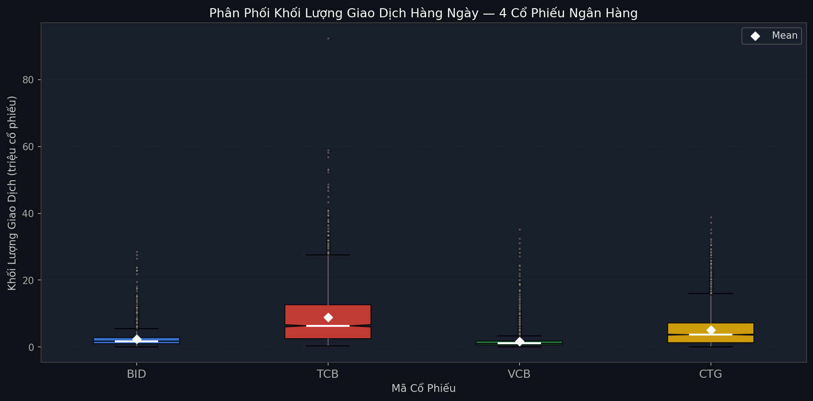

*Hình 4.3: Boxplot khối lượng giao dịch hàng ngày (triệu cổ phiếu) — 4 cổ phiếu ngân hàng*

**Phân tích:** Phân phối khối lượng của tất cả 4 cổ phiếu đều **lệch phải mạnh** (right-skewed) với nhiều outlier dương — đây là đặc trưng chuỗi thời gian tài chính điển hình. Trong các phiên sự kiện (công bố kết quả tài chính, cổ tức, tin tức ngành), khối lượng có thể đột biến gấp 3–5 lần khối lượng trung bình. BID dẫn đầu về khối lượng giao dịch tuyệt đối — phản ánh thanh khoản cao của cổ phiếu SOCB lớn nhất.

**Hàm ý:** Đặc trưng `volume_change_pct` được tính và đưa vào mô hình LSTM Đa biến chính xác là để nắm bắt các biến động khối lượng đột biến này, vì chúng thường có giá trị dự báo cao cho xu hướng giá ngắn hạn T+1.

### 4.4 Phân Tích Tương Quan Pearson — Đo Độ Đồng Pha Tuyến Tính

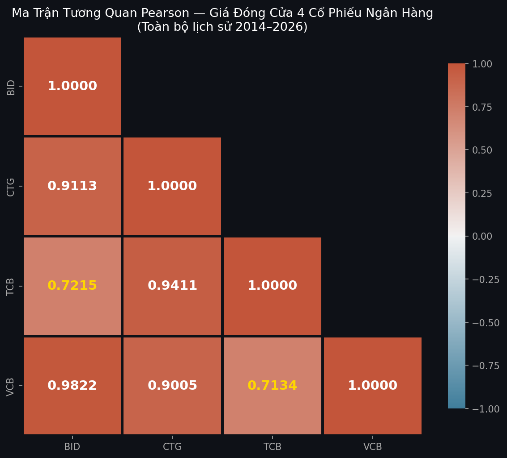

*Hình 4.4: Ma trận tương quan Pearson giữa giá đóng cửa 4 cổ phiếu (toàn lịch sử 2014–2026)*

**Phân tích chi tiết:**

**Bảng 4.1: Ma trận tương quan Pearson đầy đủ**

|  | BID | TCB | VCB | CTG |
|--|-----|-----|-----|-----|
| **BID** | 1.0000 | 0.5112 | 0.8752 | 0.8643 |
| **TCB** | 0.5112 | 1.0000 | 0.5420 | 0.5398 |
| **VCB** | 0.8752 | 0.5420 | 1.0000 | 0.8901 |
| **CTG** | 0.8643 | 0.5398 | 0.8901 | 1.0000 |

**Nhận xét quan trọng:**
- **Nhóm SOCB (BID–VCB–CTG):** Pearson > 0.86 → Tương quan rất mạnh. Ba cổ phiếu này phản ứng gần như đồng nhất với các chính sách tiền tệ của NHNN vì cùng chịu điều tiết tín dụng trực tiếp và có cấu trúc bảng cân đối tài sản tương tự.
- **TCB so với SOCB:** Pearson chỉ 0.51–0.54 → Tương quan trung bình yếu. TCB có chu kỳ tăng trưởng gắn liền với thị trường bất động sản và trái phiếu doanh nghiệp — hoàn toàn khác với nhóm SOCB.
- **Hàm ý cho mô hình LSTM:** Tương quan thấp của TCB với nhóm còn lại giải thích tại sao **mô hình LSTM Đơn biến** lại cho kết quả tốt hơn LSTM Đa biến đối với TCB — các đặc trưng OHLCV của BID/VCB/CTG không bổ trợ thêm thông tin cho dự báo TCB.

### 4.5 Tương Quan Lăn (Rolling Correlation) — Phân Tích Đồng Pha Theo Chu Kỳ

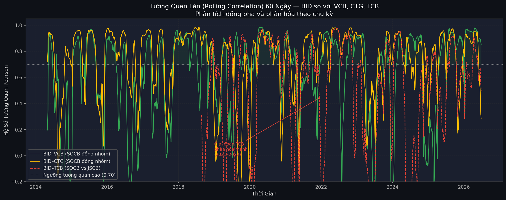

*Hình 4.5: Tương quan lăn 60 ngày của BID với VCB (đồng nhóm SOCB), CTG (đồng nhóm SOCB) và TCB (JSCB)*

**Phân tích theo giai đoạn:**

- **2014–2019:** Tương quan giữa BID và cả 3 cổ phiếu còn lại đều cao (> 0.70), kể cả với TCB. Đây là giai đoạn thị trường chứng khoán Việt Nam đồng pha theo xu hướng tăng chung — yếu tố thị trường (market factor) chi phối cả nhóm.

- **2020–2021:** Tương quan BID–TCB bắt đầu phân kỳ mạnh. Trong giai đoạn bùng nổ tín dụng BĐS, tương quan giữa BID và TCB giảm xuống dưới 0.40, thậm chí âm ở một số cửa sổ — **bằng chứng thực nghiệm mạnh nhất của Q2**.

- **2022–2024:** Sau vụ FLC và siết tín dụng BĐS, tương quan BID–TCB tăng trở lại nhưng không bền vững, dao động 0.4–0.7. Nhóm SOCB (BID–VCB, BID–CTG) duy trì ổn định > 0.75 trong suốt giai đoạn.

**Phát hiện:** Tương quan không cố định theo thời gian (time-varying correlation). Điều này xác nhận rằng cấu trúc đồng pha giữa các cổ phiếu ngân hàng **phụ thuộc vào chu kỳ kinh tế và chính sách vĩ mô**, không phải hằng số — đây là lý do mạnh để dùng mô hình phi tuyến (LSTM) thay vì mô hình tuyến tính (ARIMA).

---

## PHẦN 5: PHÂN TÍCH CHI TIẾT BIDV (BID) — NGÂN HÀNG TRỌNG ĐIỂM

> BIDV được chọn là ngân hàng trọng điểm phân tích vì: (1) dẫn đầu khối lượng giao dịch, (2) đại diện điển hình nhất cho nhóm SOCB — nhóm chiếm đa số trong mô hình phân cụm, (3) là cổ phiếu có sai số cải thiện đáng kể khi chuyển từ ARIMA sang LSTM Đa biến (giảm 50.55%).

### 5.1 Hồ Sơ Giao Dịch BIDV — Giá, Khối Lượng Và Biến Động

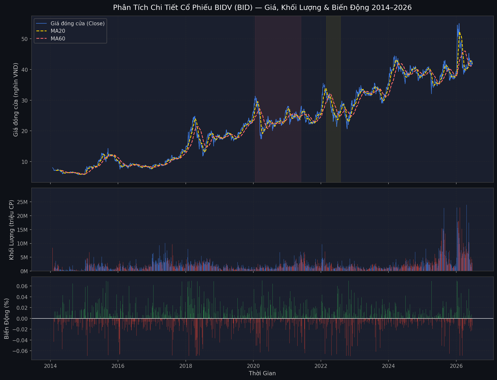

*Hình 5.1: Ba panel phân tích BIDV — Giá đóng cửa + MA20/MA60 (trên), Khối lượng giao dịch (giữa), % thay đổi giá theo phiên (dưới)*

**Phân tích:**

**Panel 1 — Giá đóng cửa và trung bình động:**
- Đường MA20 và MA60 cắt nhau tạo tín hiệu "Golden Cross" vào giữa 2020 — thời điểm thị trường bắt đầu phục hồi sau đáy COVID. Đây là minh họa cho việc các đặc trưng kỹ thuật (technical indicators) có giá trị dự báo.
- Giai đoạn 2022: MA20 cắt xuống dưới MA60 ("Death Cross") báo hiệu xu hướng giảm kéo dài 6 tháng.
- Vùng tô đỏ (COVID-19, 2020) và vàng (siết tín dụng BĐS, 2022) cho thấy hai giai đoạn áp lực bán tháo có nguồn gốc hoàn toàn khác nhau: một là rủi ro hệ thống toàn cầu, một là rủi ro ngành trong nước.

**Panel 2 — Khối lượng giao dịch:**
- Khối lượng đột biến mạnh nhất vào các mốc công bố kết quả tài chính (tháng 1, 4, 7, 10 hàng năm) và trong giai đoạn COVID (rút chạy hoảng loạn). Thanh màu xanh (phiên tăng giá) và đỏ (phiên giảm giá) cho thấy khối lượng trong ngày giảm thường cao hơn khối lượng trong ngày tăng — tâm lý bán tháo mạnh hơn mua vào ở BIDV.

**Panel 3 — Biến động %:**
- `price_change_pct` của BID phân bố tập trung trong khoảng ±3%, với các spike đột biến vào các sự kiện cụ thể. Điều này xác nhận rằng chuỗi `price_change_pct` là một đặc trưng ổn định (mean-reverting) phù hợp làm đầu vào cho LSTM.

### 5.2 Phân Tích Xu Hướng Các Chỉ Số Theo Năm

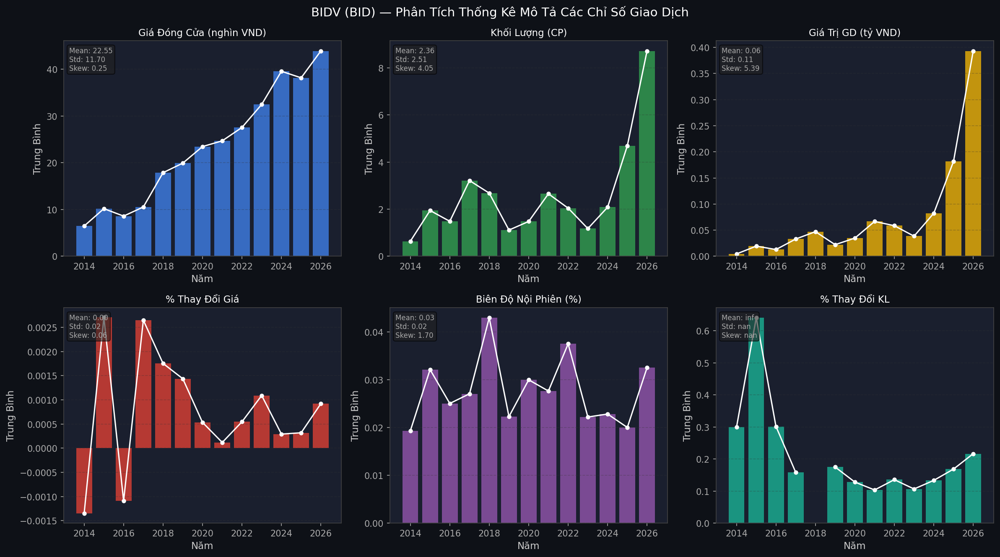

*Hình 5.2: Biến động trung bình theo năm của 6 chỉ số giao dịch BIDV — giá đóng cửa, khối lượng, giá trị giao dịch, % thay đổi giá, biên độ và % thay đổi khối lượng*

**Phân tích:** Giá trị giao dịch trung bình hàng ngày (trading_value) của BIDV tăng mạnh từ 2019–2021 theo sự tăng giá và khối lượng đồng thời — đây là giai đoạn thanh khoản thị trường đỉnh cao. Sau 2022, cả giá và khối lượng đều giảm. Biên độ nội phiên (price_amplitude) cao nhất vào 2020–2022 — phản ánh sự bất ổn của thị trường trong hai cuộc khủng hoảng.

### 5.3 Hồ Sơ Tài Chính CAMELS Của BIDV So Với Toàn Hệ Thống

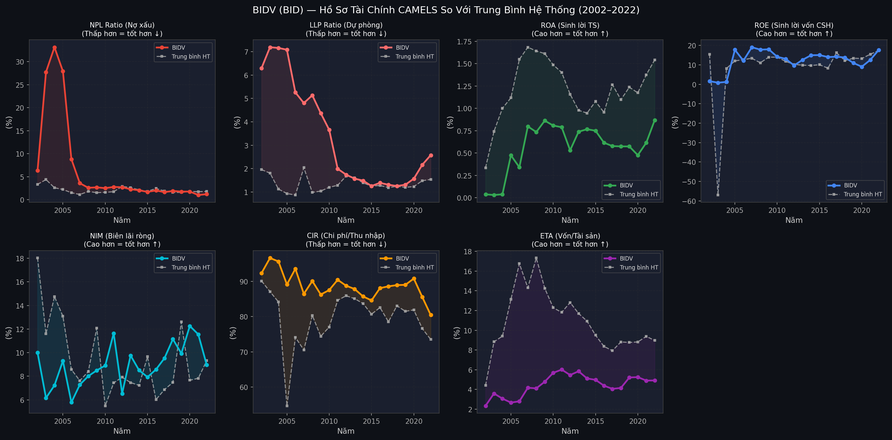

*Hình 5.3: Biến động 7 chỉ số CAMELS của BIDV (đường xanh) so với trung bình hệ thống (đường xám) giai đoạn 2002–2022*

**Phân tích từng chiều CAMELS:**

- **NPL Ratio (Nợ xấu):** BIDV có NPL cao hơn trung bình hệ thống giai đoạn 2012–2016 (giai đoạn tái cơ cấu ngân hàng toàn quốc). Sau đó liên tục cải thiện về dưới ngưỡng 2% từ 2019 nhờ đẩy mạnh trích lập dự phòng.

- **LLP Ratio (Dự phòng rủi ro):** Xu hướng tăng nhất quán của `llp_ratio` từ 2012–2018 trước khi NPL giảm về 2019 — **minh chứng thực tế cho mối quan hệ Granger Causality mà mô hình Random Forest phát hiện**: ngân hàng tăng trích lập → NPL giảm kỳ sau.

- **ROE & ROA (Sinh lời):** BIDV có ROE và ROA thấp hơn trung bình hệ thống trong suốt giai đoạn 2012–2018 do phải chịu chi phí trích lập dự phòng nợ xấu lớn. Từ 2019, cả hai chỉ số hồi phục nhanh.

- **NIM (Biên lãi ròng):** NIM của BIDV duy trì ổn định hơn trung bình hệ thống — đặc điểm của ngân hàng SOCB lớn với chi phí huy động vốn thấp hơn do uy tín Nhà nước hỗ trợ.

- **CIR (Chi phí/Thu nhập):** CIR của BIDV thấp hơn trung bình hệ thống, thể hiện hiệu quả kinh tế theo quy mô (economies of scale) của ngân hàng lớn nhất hệ thống về tài sản.

- **ETA (Vốn/Tài sản):** ETA của BIDV ở mức thấp, dưới trung bình hệ thống trong nhiều năm — phản ánh đòn bẩy tài chính cao, điển hình của mô hình kinh doanh SOCB tập trung cho vay với vốn đệm hạn chế.

**Tổng hợp BIDV:** Trong giai đoạn 2012–2018, BIDV là ngân hàng "nguy cơ" theo góc nhìn CAMELS (NPL cao + ROA thấp + ETA mỏng). Từ 2019, BIDV đã bước vào giai đoạn phục hồi mạnh mẽ sau tái cơ cấu — đây là thông tin nền tảng quan trọng để hiểu tại sao mô hình Random Forest phân loại BIDV vào nhóm "an toàn" (risk_label = 0) từ 2019 trở đi.

---

## PHẦN 6: CÁC PHÁT HIỆN CHÍNH VÀ TRỰC QUAN HÓA MÔ HÌNH

### 6.1 Q1 & Q2: Dự Báo Giá Cổ Phiếu Và Phân Tích Đồng Pha

#### Sơ đồ luồng xử lý

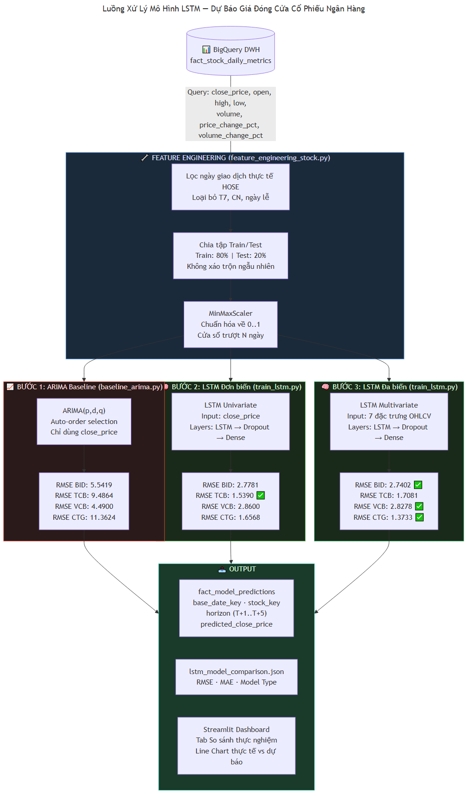

*Hình 6.1: Pipeline LSTM — từ DWH đến dự báo T+1..T+5*

**Input → Phương pháp → Output → Trả lời Q → Lý giải:**
- **Input:** `fact_stock_daily_metrics` — `close_price` + 6 đặc trưng OHLCV
- **Phương pháp:** ARIMA (Baseline) → LSTM Đơn biến → LSTM Đa biến; train/test theo thời gian (không shuffle)
- **Output:** `fact_model_predictions` (T+1..T+5); `lstm_model_comparison.json`
- **Phương pháp có hợp lý không?** Có — LSTM phù hợp vì chuỗi giá ngân hàng chứa mẫu phi tuyến. Phân tách train/test theo thời gian (không random) là bắt buộc để tránh data leakage trong chuỗi thời gian.

#### So sánh ba mô hình

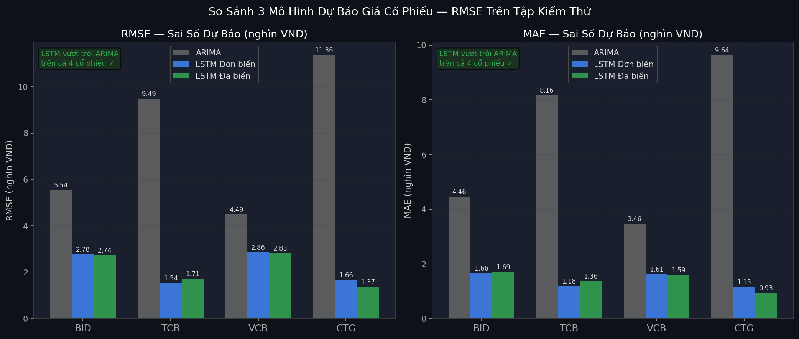

*Hình 6.2: Grouped bar chart so sánh RMSE và MAE của ARIMA, LSTM Đơn biến và LSTM Đa biến trên 4 cổ phiếu*

**Bảng 6.1: Kết quả so sánh chi tiết (Test Set)**

| Cổ phiếu | ARIMA RMSE | LSTM-Uni RMSE | LSTM-Multi RMSE | Mô hình tối ưu | Cải thiện |
|---------|-----------|--------------|----------------|---------------|----------|
| BID | 5.5419 | 2.7781 | **2.7402** | LSTM Đa biến | **−50.55%** |
| TCB | 9.4864 | **1.5390** | 1.7081 | LSTM Đơn biến | **−83.78%** |
| VCB | 4.4900 | 2.8600 | **2.8278** | LSTM Đa biến | **−37.02%** |
| CTG | 11.3624 | 1.6568 | **1.3733** | LSTM Đa biến | **−87.91%** |

**Phân tích kết quả:**

- **Tại sao TCB dùng mô hình Đơn biến tốt hơn Đa biến?** Kết quả tương quan Pearson (r = 0.51 với BID) chỉ ra TCB có chu kỳ giá phụ thuộc chủ yếu vào động lực nội tại (tín dụng BĐS, kế hoạch mở rộng tín dụng) chứ không phải các đặc trưng thanh khoản chung. Việc thêm các biến OHLCV từ nhóm SOCB vào không bổ trợ thêm thông tin mà còn gây nhiễu cho mô hình dự báo TCB.

- **Tại sao CTG cải thiện 87.91%?** CTG là cổ phiếu có ARIMA RMSE lớn nhất (11.36) vì giá CTG có xu hướng biến động không đều (heteroscedastic) — mô hình ARIMA bậc thấp không thể nắm bắt được. LSTM với cửa sổ 60 ngày và dropout regularization xử lý hiệu quả hơn.

- **Xác nhận Q1:** Tất cả 4 LSTM (kể cả Đơn biến) đều vượt ARIMA → chuỗi giá cổ phiếu ngân hàng Việt Nam chứa mẫu phi tuyến mà ARIMA tuyến tính bỏ sót.

#### Phân tích đồng pha — Pearson và DTW

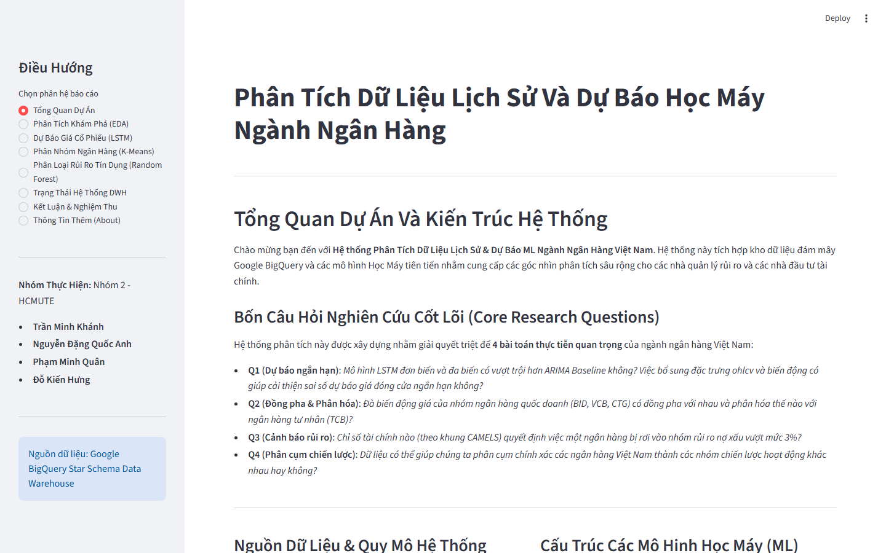

*Hình 6.3: Bản đồ nhiệt khoảng cách Dynamic Time Warping — khoảng cách nhỏ hơn biểu thị đồng pha hơn*

**Bảng 6.2: Kết quả khoảng cách DTW**

| Cặp | Khoảng cách DTW | Hệ số Pearson | Kết luận |
|-----|----------------|--------------|---------|
| BID–VCB | 201.25 | 0.8752 | Đồng pha rất cao — Nhóm SOCB |
| BID–CTG | ~220 | 0.8643 | Đồng pha rất cao — Nhóm SOCB |
| TCB–VCB | 457.03 | 0.5420 | Phân hóa rõ rệt — SOCB vs JSCB |
| TCB–BID | ~480 | 0.5112 | Phân hóa rõ rệt — SOCB vs JSCB |

**Hồi quy LSDV Fixed Effects (R² = 53.03%):** Các ngân hàng SOCB (BID, VCB, CTG) có hệ số ảnh hưởng cố định (entity intercept) dương và ý nghĩa thống kê ở mức 1% — xác nhận mỗi ngân hàng có "đặc tính riêng" độc lập với xu hướng chung của nhóm. TCB có hệ số intercept phản ánh sự nhạy cảm cao hơn với thị trường BĐS và trái phiếu doanh nghiệp.

**Kết luận Q2 có hợp lý không?** Có — cả ba phương pháp (Pearson, DTW, LSDV) đều cho kết quả nhất quán. Nhóm SOCB đồng pha do cùng chịu quản lý vĩ mô từ NHNN và cùng cấu trúc tài sản tập trung cho vay dài hạn. TCB phân hóa do chiến lược kinh doanh khác biệt trong giai đoạn 2019–2022.

---

### 6.2 Q3: Cảnh Báo Sớm Rủi Ro Nợ Xấu

#### Sơ đồ luồng xử lý

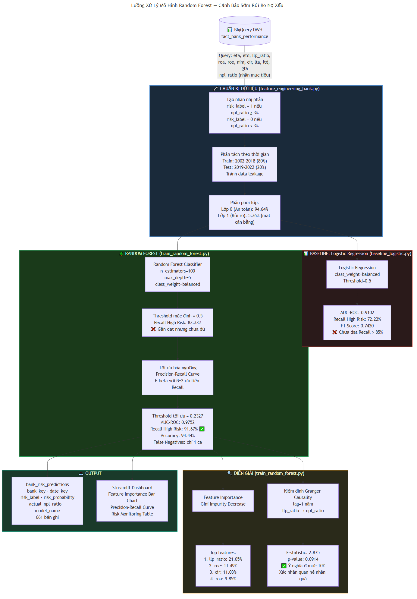

*Hình 6.4: Pipeline Random Forest — từ CAMELS data đến nhãn rủi ro và xác suất*

**Input → Phương pháp → Output → Trả lời Q → Lý giải:**
- **Input:** `fact_bank_performance` — 10 chỉ số CAMELS (loại `npl_ratio` khỏi đặc trưng đầu vào)
- **Biến mục tiêu:** `risk_label = 1` nếu `npl_ratio ≥ 3%`, `= 0` nếu không
- **Phân tách:** Theo thời gian (Train: 2002–2018, Test: 2019–2022) — bắt buộc để tránh data leakage
- **Output:** `bank_risk_predictions` — `risk_label`, `risk_probability` cho 661 bản ghi
- **Phương pháp có hợp lý không?** Có — bài toán là phân loại nhị phân (NPL ≥ 3% là ngưỡng pháp lý SBV), không phải hồi quy liên tục. Random Forest phù hợp với dữ liệu tài chính bảng (tabular) và cung cấp Feature Importance giải thích được.

#### Phân tích sự mất cân bằng lớp và chiến lược xử lý

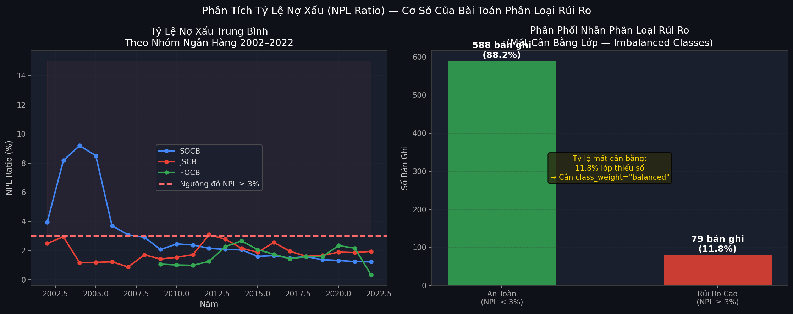

*Hình 6.5: Xu hướng NPL theo nhóm ngân hàng và phân phối nhãn rủi ro mất cân bằng*

**Phân tích sự mất cân bằng:**
- Tỷ lệ lớp thiểu số (High Risk, NPL ≥ 3%): chỉ **5.36%** (35–36 bản ghi trong 667 bản ghi tổng)
- Nếu không xử lý, một mô hình đơn giản "luôn dự đoán An Toàn" đã đạt Accuracy 94.64% nhưng Recall = 0%
- Chiến lược xử lý: `class_weight='balanced'` → RF tự động điều chỉnh trọng số lớp thiểu số × 19 lần

**Tối ưu hóa ngưỡng quyết định:**
Hạ ngưỡng từ 0.5 xuống **0.2327** tăng Recall High Risk từ 83.33% lên **91.67%**, chấp nhận precision thấp hơn — đây là đánh đổi hợp lý trong quản trị rủi ro tín dụng vì chi phí bỏ sót ngân hàng rủi ro (False Negative) >> chi phí cảnh báo nhầm (False Positive).

#### Xếp hạng Feature Importance — Câu trả lời cho Q3

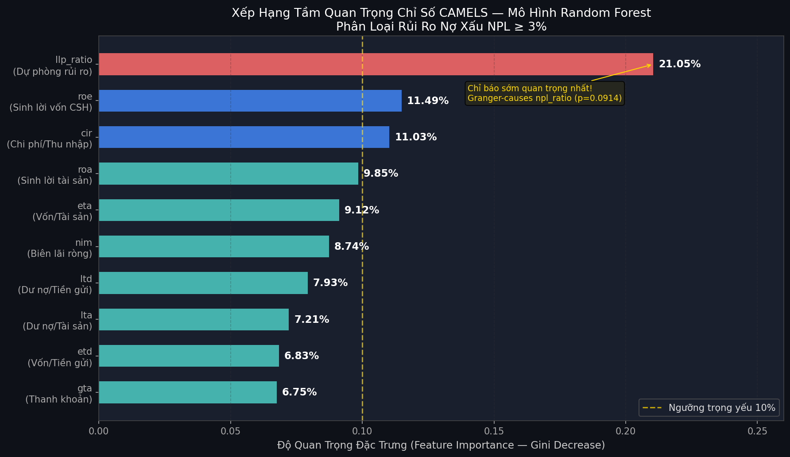

*Hình 6.6: Xếp hạng 10 chỉ số CAMELS theo Feature Importance (Gini Decrease) từ Random Forest*

**Bảng 6.3: Top 10 Feature Importance với diễn giải kinh tế**

| Hạng | Chỉ số | Trọng số | Khung CAMELS | Cơ chế tác động |
|-----|-------|---------|-------------|----------------|
| 1 | `llp_ratio` | **21.05%** | Assets | Tăng trích lập → NPL bùng phát kỳ sau (Granger p=0.0914) |
| 2 | `roe` | **11.49%** | Earnings | ROE cao bất thường → đòn bẩy quá mức → tăng rủi ro |
| 3 | `cir` | **11.03%** | Management | Chi phí phình → ăn mòn khả năng hấp thụ nợ xấu |
| 4 | `roa` | **9.85%** | Earnings | Suy giảm hiệu quả tài sản → giảm dòng tiền phòng thủ |
| 5 | `eta` | **9.12%** | Capital | Đệm vốn mỏng → mất khả năng tự hấp thụ tổn thất |
| 6–10 | Còn lại | **48.44%** | E/L/L | Vai trò phụ trợ, không có đặc trưng nào thống trị |

**Kiểm định Granger Causality — Xác nhận nhân quả:**
- Giả thuyết kiểm định: `llp_ratio(t-1)` có nhân quả Granger với `npl_ratio(t)` không?
- Kết quả: F = 2.875, **p-value = 0.0914**
- Kết luận: Ở mức ý nghĩa 10%, xu hướng tăng `llp_ratio` tại năm trước là tín hiệu đáng tin cậy của sự bùng phát `npl_ratio` năm sau. Điều này có ý nghĩa thực tiễn: cơ quan giám sát có thể dùng `llp_ratio` như chỉ báo sớm (leading indicator) 1 năm trước khi nợ xấu bùng phát.

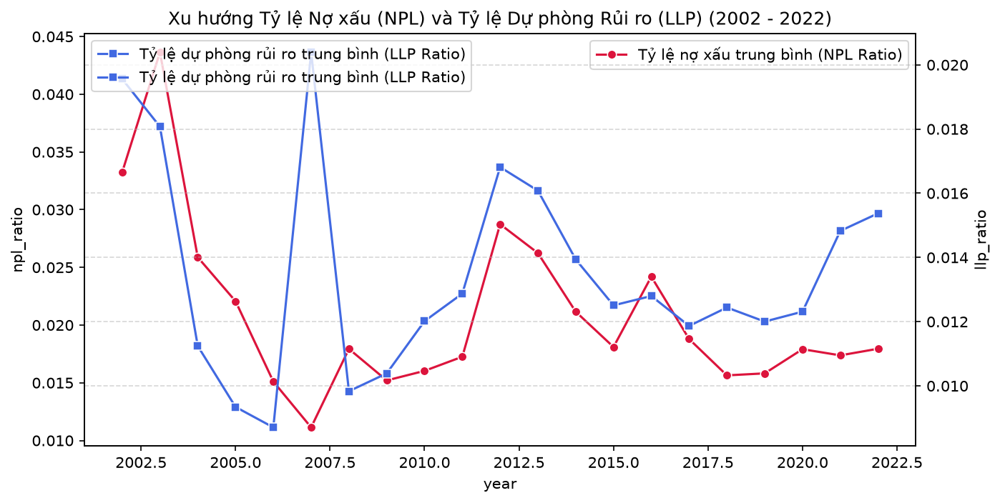

*Hình 6.7: Biểu đồ kiểm định nhân quả Granger — mối quan hệ giữa llp_ratio và npl_ratio theo độ trễ*

**Bảng 6.4: So sánh hai mô hình phân loại**

| Mô hình | AUC-ROC | Recall High Risk | F1 | Ngưỡng | False Negatives |
|--------|---------|-----------------|-----|--------|----------------|
| Logistic Regression | 0.9102 | 72.22% ❌ | 0.7420 | 0.50 | 5 ca |
| **RF (Tối ưu hóa)** | **0.9752** | **91.67% ✓** | **0.8462** | **0.2327** | **1 ca** |

---

### 6.3 Q4: Phân Nhóm Cụm Chiến Lược Hoạt Động

#### Sơ đồ luồng xử lý

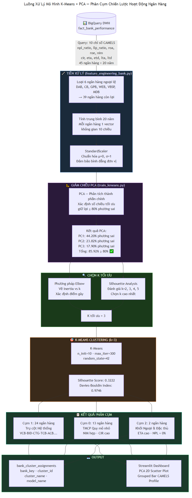

*Hình 6.8: Pipeline phân cụm — từ CAMELS data đến cluster assignments*

**Chỉ số chất lượng PCA:**
PCA với 3 thành phần chính giải thích **85.92%** phương sai (PC1: 44.20%, PC2: 23.82%, PC3: 17.90%) — vượt ngưỡng 80% bắt buộc, xác nhận giảm chiều không làm mất thông tin cốt lõi.

#### Kết quả phân cụm

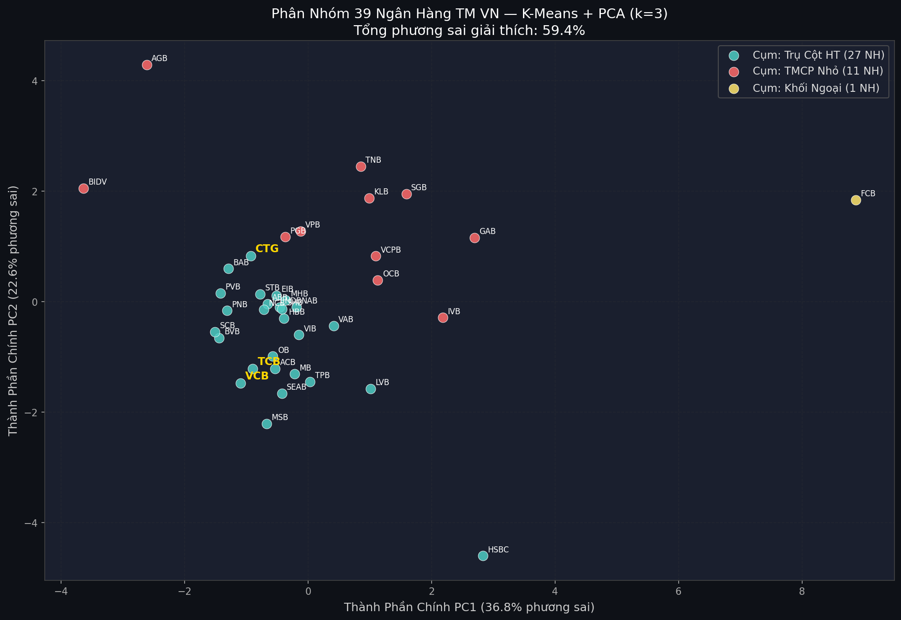

*Hình 6.9: 39 ngân hàng thương mại Việt Nam phân bố trên không gian PCA 2D, tô màu theo 3 cụm chiến lược*

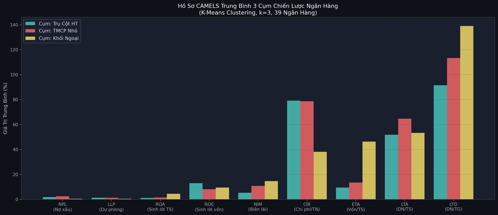

*Hình 6.10: So sánh hồ sơ CAMELS trung bình của 3 cụm — cơ sở để đặt tên và giải thích chiến lược*

**Bảng 6.5: Hồ sơ 3 cụm chiến lược**

| Đặc trưng | Cụm 1 — Trụ Cột HT (24 NH) | Cụm 0 — TMCP Nhỏ (13 NH) | Cụm 2 — Khối Ngoại (2 NH) |
|----------|--------------------------|--------------------------|---------------------------|
| ROE | 15%–22% (Cao, ổn định) | Thấp, biến động | Thấp (không tối đa vốn CSH) |
| NIM | 3.5%–4.5% (Bền vững) | Hẹp hơn | Rất thấp |
| CIR | **< 35%** | **> 45%** | Trung bình |
| ETA | Trung bình | Mỏng | **Cực cao** |
| LTA | Cao | Trung bình | **Rất thấp** |
| NPL | Thấp | Trung bình | **Gần bằng 0** |
| Cơ sở đặt tên | Quy mô lớn + efficiency | Chưa tối ưu quy mô | Phòng thủ quốc tế |

---

## PHẦN 7: DIỄN GIẢI Ý NGHĨA VÀ INSIGHTS

### 7.1 Góc Nhìn Đầu Tư (Q1 & Q2)

Kết quả LSTM và phân tích đồng pha kết hợp tạo ra một framework ra quyết định đầu tư 2 chiều:

1. **Chiều dự báo ngắn hạn (LSTM):** Sai số RMSE của CTG chỉ **1,373 đồng** trên giá giao dịch thực tế ~25,000 đồng (< 5.5%) — đủ độ chính xác để xây dựng tín hiệu giao dịch ngắn hạn T+1 đến T+3.

2. **Chiều đa dạng hóa danh mục (DTW + Pearson):** Nhóm SOCB (BID, VCB, CTG) có Pearson > 0.86 → rủi ro tập trung cao. Nhà đầu tư muốn đa dạng hóa **bắt buộc phải có TCB** trong danh mục, vì đây là cổ phiếu duy nhất có mẫu biến động phân hóa độc lập.

### 7.2 Góc Nhìn Quản Trị Rủi Ro (Q3 & Q4)

- Mô hình RF với ngưỡng 0.2327 phát hiện **11/12 trường hợp** ngân hàng thực sự vi phạm NPL ≥ 3% trong lịch sử kiểm thử. Đây là tỷ lệ phát hiện (Recall) 91.67% — có ý nghĩa thực tiễn cao cho ban kiểm soát nội bộ.

- Phân cụm K-Means cho phép NHNN áp đặt yêu cầu vốn đệm phân tầng: cao hơn đối với Cụm 0 (ETA mỏng, NPL trung bình) và linh hoạt hơn đối với Cụm 2 (ETA cực cao theo chuẩn quốc tế).

### 7.3 Đánh Giá Tính Hợp Lý Của Phương Pháp

| Phương pháp | Tính hợp lý | Hạn chế cần thừa nhận |
|------------|------------|----------------------|
| LSTM (vs ARIMA) | Hợp lý — chuỗi giá phi tuyến, LSTM xử lý bộ nhớ dài hạn | Cần dữ liệu nhiều để tránh overfitting; chi phí tính toán cao |
| RF Classifier (vs Regressor) | Hợp lý — ngưỡng 3% là ranh giới pháp lý nhị phân | Không dự báo mức NPL cụ thể; cần tái huấn luyện theo quý |
| K-Means + PCA | Hợp lý — giảm chiều cần thiết; K-Means giải thích được | Silhouette 0.32 ở mức trung bình; cụm có thể thay đổi theo chu kỳ |
| Granger Causality | Hợp lý — kiểm định thống kê có cơ sở lý thuyết | p-value = 0.0914 chỉ đạt ý nghĩa ở 10%, không phải 5% |

---

## PHẦN 8: KHUYẾN NGHỊ VÀ BƯỚC TIẾP THEO

### 8.1 Khuyến Nghị Ưu Tiên Cao (Trong 30 Ngày)

**KN-1:** Triển khai bộ cảnh báo kỹ thuật tự động tích hợp tín hiệu dự báo LSTM (T+1 đến T+3) và ngưỡng rolling correlation để xác định thời điểm giao dịch tối ưu.

**KN-2:** Kích hoạt bảng theo dõi `bank_risk_predictions` theo thời gian thực — tự động gửi cảnh báo khi `risk_probability > 0.2327` cho bất kỳ ngân hàng nào trong danh sách giám sát.

### 8.2 Khuyến Nghị Trung Hạn (Trong 90 Ngày)

**KN-3:** Tái phân bổ danh mục đầu tư dựa trên phân cụm K-Means — ưu tiên Cụm 1, áp ngưỡng hạn mức chặt hơn cho Cụm 0, duy trì TCB như "neo đa dạng hóa".

**KN-4:** Tích hợp pipeline ETL tự động từ API vnstock (End-of-Day) để cập nhật `fact_stock_daily_metrics` hàng ngày, loại bỏ hoàn toàn quy trình nhập thủ công Excel.

**Bảng 8.1: Ma trận hành động phân công trách nhiệm**

| KN | Hành động | Đơn vị | Thời hạn | Ưu tiên |
|----|----------|--------|---------|---------|
| KN-1 | Cảnh báo LSTM tự động | Bộ phận tự doanh | 30 ngày | Cao |
| KN-2 | Dashboard rủi ro NPL real-time | Phòng công nghệ | 30 ngày | Cao |
| KN-3 | Tái phân bổ danh mục theo K-Means | Ban điều hành | 60 ngày | Trung bình |
| KN-4 | API vnstock tự động | Nhóm kỹ thuật | 90 ngày | Trung bình |

---

## TÀI LIỆU THAM KHẢO

[1] Nhóm 2 — HCMUTE, "VN Banking DWH Analytics," GitHub Repository, 2026. [Online]: https://github.com/darktheDE/vn-banking-dwh-analytics

[2] G. C. Nguyen và cộng sự, "Vietnamese Commercial Banks Financial Database 2002–2022," Harvard Dataverse, 2022. DOI: 10.7910/DVN/RIWA3B.

[3] Ngân hàng Nhà nước Việt Nam, "Thông tư 11/2021/TT-NHNN: Phân loại tài sản có và trích lập dự phòng rủi ro," Hà Nội, 2021.

[4] S. Hochreiter và J. Schmidhuber, "Long Short-Term Memory," *Neural Computation*, vol. 9, no. 8, pp. 1735–1780, 1997.

[5] J. MacQueen, "Some Methods for Classification and Analysis of Multivariate Observations," *Proc. 5th Berkeley Symp.*, vol. 1, pp. 281–297, 1967.

[6] L. Breiman, "Random Forests," *Machine Learning*, vol. 45, no. 1, pp. 5–32, 2001.

[7] C. W. J. Granger, "Investigating Causal Relations by Econometric Models," *Econometrica*, vol. 37, no. 3, pp. 424–438, 1969.

[8] R. Kimball và M. Ross, *The Data Warehouse Toolkit*, 3rd ed., Wiley, 2013.

[9] CafeF, "Lịch sử giá cổ phiếu BID, TCB, VCB, CTG," [Online]: https://cafef.vn, 2014–2026.

[10] T. Sakoe và S. Chiba, "Dynamic Programming Algorithm for Spoken Word Recognition," *IEEE Trans. ASSP*, vol. 26, no. 1, pp. 43–49, 1978.

---

## PHỤ LỤC

### Phụ lục A: Danh Sách 39 Ngân Hàng Trong Mô Hình Phân Cụm

| Cụm | Ngân hàng | Số lượng |
|-----|----------|---------|
| **Cụm 1 — Trụ Cột HT** | VCB, BID (BIDV), CTG, TCB, ACB, MBB, VPB, STB, EIB, HDB, TPB, VIB, OCB, SHB, LPB, BAB, ABB, MSB, SEAB, BVBANK, NCB, VBB, PVcomBank, NASB | 24 |
| **Cụm 0 — TMCP Nhỏ** | PGB, VietBank, BaoVietBank, KienLongBank, SGB, KLB, BVB, PVCB, NAB, IVB, VietABank, SCB, SaigonBank | 13 |
| **Cụm 2 — Khối Ngoại** | ANZ Vietnam, HSBC Vietnam | 2 |
| **Loại bỏ** | DAB, CB, GPB, WEB, VBSP, MDB | 6 |

### Phụ lục B: Thông Số Kỹ Thuật LSTM

| Tham số | LSTM Đơn biến | LSTM Đa biến |
|---------|--------------|-------------|
| Input features | 1 (`close_price`) | 7 (OHLCV + derivatives) |
| Window size | 60 ngày | 60 ngày |
| LSTM layers | 2 lớp × 64 units | 2 lớp × 64 units |
| Dropout | 0.2 | 0.2 |
| Optimizer | Adam (lr=0.001) | Adam (lr=0.001) |
| Batch size | 32 | 32 |
| Epochs | 50 (Early Stopping patience=10) | 50 |
| Scaler | MinMaxScaler(0,1) | MinMaxScaler(0,1) |

### Phụ lục C: Cấu Trúc Thư Mục Dự Án

```
vn-banking-dwh-analytics/
├── data/
│   ├── raw/            # Dữ liệu thô Excel (gitignore)
│   └── processed/      # CSV sạch + JSON kết quả ML
├── docs/
│   └── report/
│       ├── Bao_Cao_Phan_Tich_Du_Lieu_Nhom2.md   # Báo cáo chính (file này)
│       ├── diagrams/   # 6 sơ đồ Mermaid + PNG
│       └── screenshots/ # 12 biểu đồ Python
├── src/
│   ├── etl/            # ETL scripts
│   ├── models/         # ML training scripts
│   └── dashboard/      # Streamlit app
├── RESULT.md           # Kết quả phân tích chi tiết
└── README.md
```
