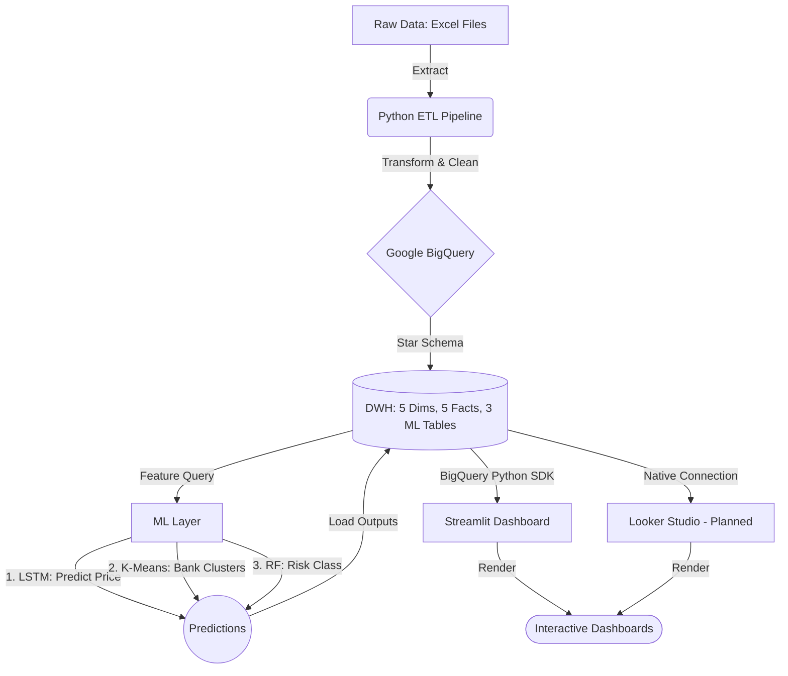

# System Architecture Design

## 1. High-Level Architecture Overview

The Financial Data Analytics Platform is designed as an end-to-end, batch-processing data pipeline. It integrates raw data extraction, cloud-based warehousing, advanced machine learning models, and interactive business intelligence. The architecture follows a highly decoupled, modular design to ensure scalability, maintainability, and data integrity.

The system is logically divided into 5 distinct layers:
1. Data Source Layer
2. Data Ingestion & Processing Layer
3. Data Storage Layer
4. Machine Learning & Analytics Layer
5. Presentation & Serving Layer

---

## 2. Layer-by-Layer Architecture

### 2.1 Data Source Layer

The origin of all data entering the system.
- **Data Types**: Structured and semi-structured financial data.
- **Sources**: Primary files containing:
- Daily aggregated stock history, balance sheets, income statements, and cash flows for focus banks (BID, TCB, VCB, CTG).
- Daily aggregated stock order stats, foreign and proprietary trading values for BID.
- 20-year financial performance indicators based on CAMELS framework for 46 commercial banks.
- **Characteristics**: Heterogeneous formats, missing values, and varying temporal granularities from tick-level to daily and annual.

### 2.2 Data Ingestion & Processing Layer

Responsible for preparing the raw data for storage and modeling.
- **Technology Stack**: Python with Pandas and Openpyxl.
- **Process Flow**:
- **Extract**: Read raw Excel documents into DataFrames.
- **Transform**:
- Handle missing values using Forward-fill for daily stock data and Statistical Imputation for missing 2002-2005 bank data.
- Standardize date-time strings to standard ISO formats.
- Normalize numerical features using StandardScaler and MinMaxScaler preparing them for downstream ML.
- **Load**: Push cleaned and structured DataFrames into the Cloud DWH using the Google Cloud BigQuery API.
- **Execution Strategy**: Scheduled Batch processing running End-of-Day for stock data and Quarterly for banking data.

### 2.3 Data Storage Layer

The centralized “Single Source of Truth.”
- **Technology Stack**: Google BigQuery as a Serverless Enterprise Data Warehouse.
- **Design Pattern**: **Star Schema** optimized for OLAP aggregations.
- **Dimension Tables**: `dim_date`, `dim_stock`, `dim_bank`, `dim_trading_session`, `dim_audit`.
- **Fact Tables**: `fact_foreign_trading`, `fact_proprietary_trading`, `fact_price_history`, `fact_order_stats`, `fact_bank_performance`.
- **ML Output Tables**: `bank_cluster_assignments`, `bank_risk_predictions`, `fact_model_predictions`.
- **Optimization**: Partitioning applied on `date_key` and Clustering applied on `stock_key` and `bank_key` to heavily reduce query latency and scanning costs for reporting.

### 2.4 Machine Learning & Analytics Layer

The core intelligence of the platform, executing both supervised and unsupervised learning tasks.
- **Technology Stack**: Scikit-Learn and TensorFlow Keras.
- **Models**:
1. **Time Series Forecasting**: LSTM deep learning networks forecasting short-term from T+1 to T+5 stock prices for focus banks (BID, TCB, VCB, CTG) based on historical price sequences.
2. **Clustering**: PCA dimensionality reduction followed by K-Means unsupervised clustering to group the 46 banks by financial behavior.
3. **Risk Classification**: Random Forest ensemble decision trees classifying banks into ‘High Risk’ with NPL greater than or equal to 3% versus ‘Healthy’, outputting clear Feature Importance metrics.
- **MLOps Integration**: Models consume data directly from BigQuery Fact and Dim tables, run their inferences as Python Batch Jobs, and write the prediction outputs back into new Fact tables in BigQuery such as `fact_model_predictions`.

### 2.5 Presentation & Serving Layer

The front-end interface where stakeholders interact with the data and insights.
- **Technology Stack**: Streamlit (implemented) and Looker Studio (planned).
- **Data Connection**: Native, direct connector to Google BigQuery eliminating manual CSV exports. Streamlit uses `google-cloud-bigquery` Python SDK with `create_bqstorage_client=False` to bypass Storage API permission restrictions.
- **Streamlit Dashboard** (`src/dashboard/app.py`):
    - **Market Price Forecasting (LSTM)**: Interactive line chart of historical vs. LSTM-predicted closing prices for BID, TCB, VCB, and CTG with T+1 to T+5 forecast horizon table.
    - **Bank Clustering (K-Means)**: PCA 2D scatter plot of 46 banks color-coded by cluster, grouped bar chart comparing average CAMELS ratios across clusters, and filterable bank member tables.
    - **Credit Risk Classifier (RF)**: Pie chart of risk distribution, horizontal bar chart of Random Forest feature importances, and a live searchable risk monitoring table with color-coded alert labels.
    - **DWH System Status**: Real-time row counts and schema metadata for all 10 Star Schema tables.
- **Looker Studio Dashboards** (planned):
    - **Market Movement**: Visualizes historical vs. LSTM-predicted prices alongside foreign and proprietary cash flow volume bars.
    - **Bank Profiling**: Scatter plots and radar charts displaying K-Means clustering results.
    - **Risk Monitoring**: Risk classification matrix detailing which banks are approaching or exceeding the 3% NPL threshold based on Random Forest predictions.

---

## 3. Data Flow Diagram

---

## 4. Security & Infrastructure Dependencies

- **Authentication**: Google Cloud IAM Service Accounts using JSON Key used by the Python ETL scripts to securely authenticate writes and reads to BigQuery.
- **Scalability**: BigQuery dynamically scales storage and compute. The Python ETL and ML training can currently be executed locally, but are designed to be easily containerized with Docker and deployed onto a serverless environment such as Google Cloud Run in the future.
- **Cost Management**: BigQuery costs are actively controlled by strict Partitioning and Clustering constraints, ensuring Looker Studio dashboards do not execute expensive full-table scans.